# 💾 Complete Drives (C:,D:, and E:) Reorganization & Profile Migration Guide

## 📑 Table of Contents

1. [📋 Planning & Prerequisites](#-planning--prerequisites)
2. [🔧 Drive Preparation & Partitioning](#-drive-preparation--partitioning) 
3. [👤 User Profile Migration](#-user-profile-migration)
4. [🐳 Docker & Container Migration](#-docker--container-migration)
5. [🐧 WSL2 Environment Migration](#-wsl2-environment-migration)
6. [🤖 OLLAMA & FABRIC Configuration](#-ollama--fabric-configuration)

---

## 📋 Planning & Prerequisites

### 🎯 Migration Overview

This guide will help you reorganize your Windows system across three drives for optimal performance:

```mermaid
graph TB
    subgraph "🎯 Target Configuration"
        C["💿 C: Drive (SSD 4TB)<br/>🚀 Minimal Boot Drive<br/>• Windows OS<br/>• Installed Software<br/>• System Files"]
        D["💿 D: Drive (SSD 4TB)<br/>⚡ Development Runtime<br/>• WSL2 Distributions<br/>• Docker Runtime<br/>• OLLAMA Cache<br/>• FABRIC Tools"]
        E["💿 E: Drive (SATA 8TB)<br/>📂 User Data & Storage<br/>• User Profile Folders<br/>• Persistent Volumes<br/>• Model Archives<br/>• Project Data"]
    end
    
    style C fill:#e1f5fe,stroke:#01579b,stroke-width:2px,color:#000
    style D fill:#f3e5f5,stroke:#4a148c,stroke-width:2px,color:#000  
    style E fill:#e8f5e8,stroke:#1b5e20,stroke-width:2px,color:#000
```



### ⚠️ Critical Prerequisites

**🛡️ Backup Requirements** (MANDATORY)
- [ ] Full system image backup to external drive
- [ ] Export all WSL2 distributions: `wsl --export <DistroName> backup.tar`
- [ ] Docker volume backup: `docker run --rm -v volume_name:/data -v $(pwd):/backup busybox tar cvf /backup/backup.tar /data`
- [ ] User data backup to external storage
- [ ] Registry backup: `regedit` → Export HKEY_CURRENT_USER

**🔧 Required Tools**
- [ ] **Disk Management** (built-in Windows)
- [ ] **Robocopy** (built-in Windows) 
- [ ] **PowerShell 7+** (elevated privileges)
- [ ] **WSL2** already installed
- [ ] **Docker Desktop** already installed
- [ ] **External backup drive** (minimum 500GB free space)

**📊 Pre-Migration Assessment**

Run these commands to assess current usage:

```powershell
# Check current drive usage
Get-WmiObject -Class Win32_LogicalDisk | Select-Object DeviceID, Size, FreeSpace, @{Name="UsedSpace(GB)";Expression={[math]::Round(($_.Size - $_.FreeSpace)/1GB,2)}}

# List WSL2 distributions
wsl --list --verbose

# Check Docker system usage  
docker system df

# Find large files in user profile
Get-ChildItem $env:USERPROFILE -Recurse -File | Sort-Object Length -Descending | Select-Object -First 20 FullName, @{Name="Size(MB)";Expression={[math]::Round($_.Length/1MB,2)}}
```

### 📋 Migration Checklist

**Phase 1: Preparation**
- [ ] Complete all backups
- [ ] Verify drive health with `chkdsk`
- [ ] Close all applications
- [ ] Disable antivirus temporarily
- [ ] Create system restore point

**Phase 2: Execution Order**
1. 🔧 Drive preparation and partitioning
2. 👤 User profile folder migration  
3. 🐳 Docker data relocation
4. 🐧 WSL2 distribution migration
5. 🤖 OLLAMA and FABRIC configuration
6. 🧪 System validation and testing

### 🚨 Safety Protocols

**Rollback Strategy**
- Keep original data until migration is fully validated
- Document all registry changes made
- Maintain system restore points at each phase
- Test each component before proceeding to next phase

**Validation Checkpoints**
- File integrity checks after each move
- Application functionality tests
- Performance benchmarking
- User profile accessibility verification

[🔝 Back to TOC](#-table-of-contents)

---

## 🔧 Drive Preparation & Partitioning

### 🎯 Drive Configuration Strategy

This section sets up your three-drive architecture for optimal performance distribution.

```mermaid
graph LR
    subgraph "🔧 Drive Setup Process"
        A["📱 Check Current State"] --> B["🔍 Analyze Partitions"]
        B --> C["📏 Plan Allocation"]  
        C --> D["⚙️ Configure Drives"]
        D --> E["✅ Verify Setup"]
    end
    
    style A fill:#fff3e0,stroke:#e65100,stroke-width:2px,color:#000
    style B fill:#fff3e0,stroke:#e65100,stroke-width:2px,color:#000
    style C fill:#fff3e0,stroke:#e65100,stroke-width:2px,color:#000
    style D fill:#fff3e0,stroke:#e65100,stroke-width:2px,color:#000
    style E fill:#e8f5e8,stroke:#2e7d32,stroke-width:2px,color:#000
```



### 📊 Current Drive Assessment

**Step 1: Inventory Current Drives**

Open PowerShell as Administrator and run:

```powershell
# Get detailed drive information
Get-Disk | Format-Table Number, FriendlyName, Size, HealthStatus, PartitionStyle -AutoSize

# Check partition layout
Get-Partition | Format-Table DiskNumber, PartitionNumber, DriveLetter, Size, Type -AutoSize

# Verify file system types
Get-Volume | Where-Object {$_.DriveLetter} | Format-Table DriveLetter, FileSystemType, Size, SizeRemaining -AutoSize
```

### 🔍 Drive Health Verification

**Step 2: Check Drive Health**

```powershell
# Check each drive for errors
chkdsk C: /f /r /x
chkdsk D: /f /r /x  
chkdsk E: /f /r /x

# Check SMART status
Get-PhysicalDisk | Get-StorageReliabilityCounter | Format-Table DeviceId, Wear, ReadErrorsTotal, Temperature -AutoSize
```

### ⚙️ Optimal Drive Configuration

**Step 3: Configure Drive Settings**

**C: Drive (SSD 4TB) - Boot Optimization**

```powershell
# Optimize C: drive for system performance
fsutil behavior set DisableLastAccess 1
fsutil behavior set EncryptPagingFile 0

# Configure page file (if keeping on C:)
# Recommend: Initial = 2048MB, Maximum = 4096MB
wmic computersystem where name="%computername%" set AutomaticManagedPagefile=False
wmic pagefileset where name="C:\\pagefile.sys" set InitialSize=2048,MaximumSize=4096
```

**D: Drive (SSD 4TB) - Development Runtime**

```powershell
# Create development directories
New-Item -Path "D:\WSL2" -ItemType Directory -Force
New-Item -Path "D:\Docker" -ItemType Directory -Force  
New-Item -Path "D:\OLLAMA" -ItemType Directory -Force
New-Item -Path "D:\FABRIC" -ItemType Directory -Force
New-Item -Path "D:\DevCache" -ItemType Directory -Force

# Set optimal NTFS settings for development workloads
fsutil behavior set DisableLastAccess 1
```

**E: Drive (SATA 8TB) - Storage Configuration**

```powershell
# Create user profile structure
New-Item -Path "E:\Users" -ItemType Directory -Force
New-Item -Path "E:\Users\$env:USERNAME" -ItemType Directory -Force
New-Item -Path "E:\DockerVolumes" -ItemType Directory -Force
New-Item -Path "E:\WSL2Data" -ItemType Directory -Force  
New-Item -Path "E:\OLLAMA-Archive" -ItemType Directory -Force
New-Item -Path "E:\Projects" -ItemType Directory -Force

# Optimize for large file storage
fsutil behavior set DisableLastAccess 1
```

### 🏷️ Drive Labeling and Organization

**Step 4: Label Drives Appropriately**

```powershell
# Set meaningful drive labels
Set-Volume -DriveLetter C -NewFileSystemLabel "BOOT-SYS"
Set-Volume -DriveLetter D -NewFileSystemLabel "DEV-RUNTIME"  
Set-Volume -DriveLetter E -NewFileSystemLabel "USER-DATA"
```

### 🔐 Permissions and Security Setup

**Step 5: Configure Drive Permissions**

```powershell
# Grant current user full control over development drives
icacls "D:\" /grant "$env:USERNAME:(OI)(CI)F" /T
icacls "E:\Users\$env:USERNAME" /grant "$env:USERNAME:(OI)(CI)F" /T

# Set proper inheritance
icacls "D:\" /inheritance:e
icacls "E:\Users" /inheritance:e
```

### ✅ Drive Setup Validation

**Step 6: Verify Configuration**

```powershell
# Confirm drive setup
Write-Host "=== Drive Configuration Summary ===" -ForegroundColor Green
Get-Volume | Where-Object {$_.DriveLetter -match "[CDE]"} | Format-Table DriveLetter, FileSystemLabel, Size, SizeRemaining -AutoSize

# Test write permissions
"Test" | Out-File "D:\test.txt" -Force
"Test" | Out-File "E:\test.txt" -Force
Remove-Item "D:\test.txt" -Force -ErrorAction SilentlyContinue
Remove-Item "E:\test.txt" -Force -ErrorAction SilentlyContinue
Write-Host "✅ Drive permissions configured successfully" -ForegroundColor Green
```

### 🎯 Next Steps Preparation

**Step 7: Prepare for User Migration**

```powershell
# Create symbolic link preparation script
$prepScript = @"
# This will be used in the next section
# Symbolic links will redirect C:\Users\$env:USERNAME to E:\Users\$env:USERNAME
Write-Host "Drive preparation complete - Ready for user profile migration"
"@

$prepScript | Out-File "D:\migration-prep.ps1" -Force
```

[🔝 Back to TOC](#-table-of-contents)
