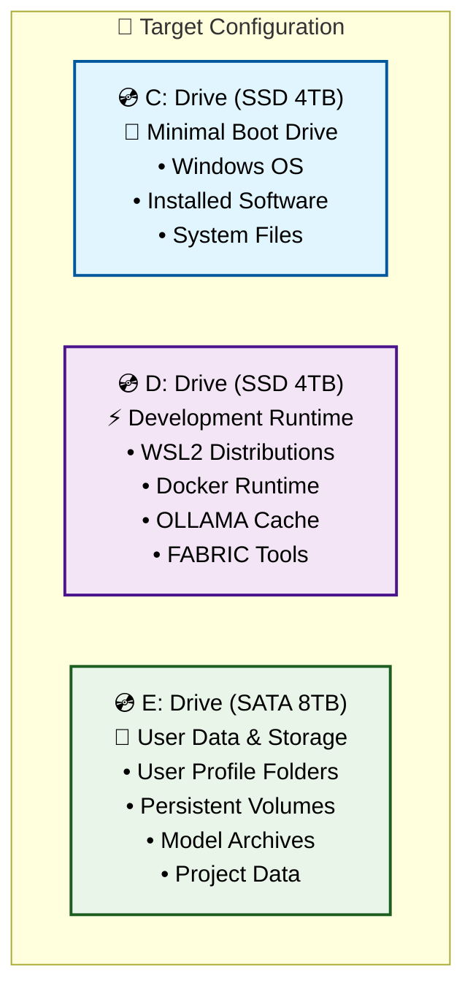
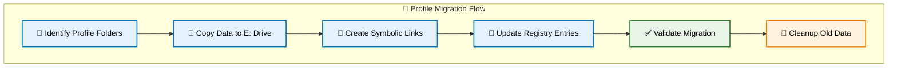
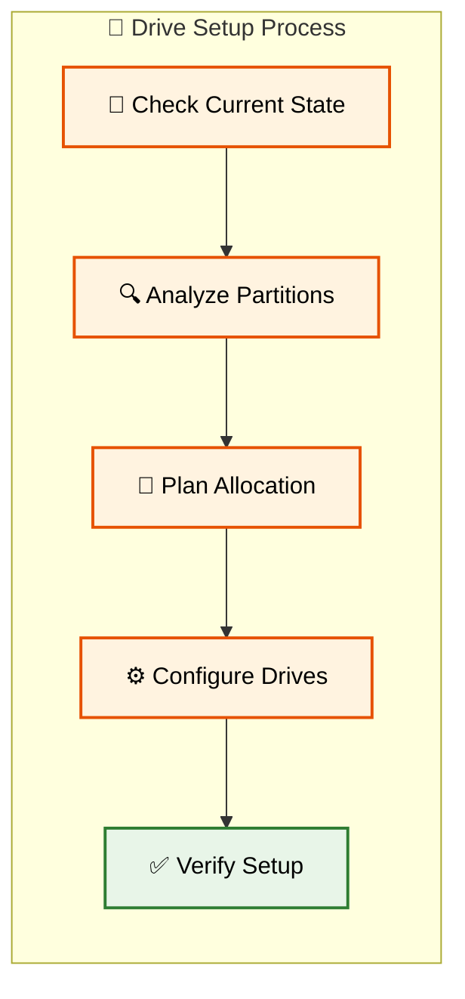

# 💾 Complete Drives (C:,D:, and E:) Reorganization & Profile Migration Guide-04

[🔝 Back to TOC](#-table-of-contents)

---

## 🐳 Docker & Container Migration

### 🎯 Docker Migration Strategy

This section relocates Docker Desktop data and containers from C: drive to D: drive for runtime and E: drive for persistent storage.

```mermaid
graph TD
    subgraph "🐳 Docker Migration Process"
        A["🔍 Analyze Current Setup"] --> B["⏹️ Stop Docker Services"]
        B --> C["📦 Export Containers & Images"]
        C --> D["🚚 Move Data Directories"]
        D --> E["⚙️ Reconfigure Docker"]
        E --> F["📥 Import Data Back"]
        F --> G["✅ Validate Functionality"]
    end
    
    style A fill:#e1f5fe,stroke:#0277bd,stroke-width:2px,color:#000
    style B fill:#ffebee,stroke:#d32f2f,stroke-width:2px,color:#000
    style C fill:#fff3e0,stroke:#f57c00,stroke-width:2px,color:#000
    style D fill:#f3e5f5,stroke:#7b1fa2,stroke-width:2px,color:#000
    style E fill:#e8f5e8,stroke:#388e3c,stroke-width:2px,color:#000
    style F fill:#e3f2fd,stroke:#1976d2,stroke-width:2px,color:#000
    style G fill:#e8f5e8,stroke:#2e7d32,stroke-width:2px,color:#000
```



### 🔍 Pre-Migration Docker Assessment

**Step 1: Analyze Current Docker Installation**

```powershell
# Check Docker installation and current data locations
Write-Host "=== Docker Installation Analysis ===" -ForegroundColor Cyan

# Get Docker Desktop installation path
$dockerPath = Get-ItemProperty "HKLM:\SOFTWARE\Microsoft\Windows\CurrentVersion\Uninstall\Docker Desktop" -ErrorAction SilentlyContinue
if ($dockerPath) {
    Write-Host "Docker Desktop Installation: $($dockerPath.InstallLocation)" -ForegroundColor Green
} else {
    Write-Host "⚠️ Docker Desktop not found in standard location" -ForegroundColor Yellow
}

# Check current Docker data root
$dockerInfo = docker info --format "{{.DockerRootDir}}" 2>$null
if ($dockerInfo) {
    Write-Host "Current Docker Root: $dockerInfo" -ForegroundColor Yellow
} else {
    Write-Host "❌ Docker not running or not accessible" -ForegroundColor Red
}

# List current containers and images
Write-Host "`n=== Current Docker Resources ===" -ForegroundColor Cyan
docker container ls -a --format "table {{.Names}}\t{{.Status}}\t{{.Size}}"
docker image ls --format "table {{.Repository}}\t{{.Tag}}\t{{.Size}}"

# Check Docker system usage
docker system df
```

**Step 2: Identify Docker Data Locations**

```powershell
# Find Docker data directories
$possibleLocations = @(
    "$env:LOCALAPPDATA\Docker",
    "$env:APPDATA\Docker",
    "$env:PROGRAMDATA\Docker", 
    "$env:USERPROFILE\.docker",
    "C:\ProgramData\DockerDesktop"
)

Write-Host "`n=== Docker Data Locations ===" -ForegroundColor Cyan
foreach ($location in $possibleLocations) {
    if (Test-Path $location) {
        $size = (Get-ChildItem $location -Recurse -ErrorAction SilentlyContinue | Measure-Object -Property Length -Sum).Sum / 1GB
        Write-Host "📂 Found: $location ($([math]::Round($size, 2)) GB)" -ForegroundColor Green
    }
}
```

### 📦 Export Docker Resources

**Step 3: Export Containers and Images**

```powershell
# Create export directory
$exportPath = "E:\DockerBackup\$(Get-Date -Format 'yyyyMMdd-HHmmss')"
New-Item -Path $exportPath -ItemType Directory -Force | Out-Null

Write-Host "=== Exporting Docker Resources ===" -ForegroundColor Cyan
Write-Host "Export location: $exportPath" -ForegroundColor Green

# Export all Docker images
Write-Host "📦 Exporting Docker images..." -ForegroundColor Yellow
$images = docker image ls --format "{{.Repository}}:{{.Tag}}" | Where-Object { $_ -ne "<none>:<none>" }
foreach ($image in $images) {
    $safeName = $image -replace "[:/]", "_"
    $exportFile = "$exportPath\image_$safeName.tar"
    Write-Host "Exporting: $image"
    docker save -o $exportFile $image
}

# Export container configurations (not data, just configs)
Write-Host "📋 Exporting container configurations..." -ForegroundColor Yellow
$containers = docker container ls -a --format "{{.Names}}"
$containerConfigs = @()
foreach ($container in $containers) {
    $config = docker inspect $container | ConvertFrom-Json
    $containerConfigs += $config
}
$containerConfigs | ConvertTo-Json -Depth 10 | Out-File "$exportPath\container-configs.json" -Encoding UTF8

# List and backup named volumes
Write-Host "💾 Backing up Docker volumes..." -ForegroundColor Yellow
$volumes = docker volume ls --format "{{.Name}}"
foreach ($volume in $volumes) {
    Write-Host "Backing up volume: $volume"
    docker run --rm -v "$volume":/data -v "$exportPath":/backup alpine tar czf /backup/volume_$volume.tar.gz -C /data .
}

Write-Host "✅ Docker export completed" -ForegroundColor Green
```

### ⏹️ Stop Docker Services

**Step 4: Safely Stop Docker**

```powershell
Write-Host "=== Stopping Docker Services ===" -ForegroundColor Red

# Stop Docker Desktop gracefully
Write-Host "Stopping Docker Desktop..." -ForegroundColor Yellow
Stop-Process -Name "Docker Desktop" -Force -ErrorAction SilentlyContinue

# Stop Docker Engine
Write-Host "Stopping Docker Engine..." -ForegroundColor Yellow  
Stop-Service -Name "docker" -Force -ErrorAction SilentlyContinue

# Stop related services
$dockerServices = @("com.docker.service", "docker", "dockerd")
foreach ($service in $dockerServices) {
    try {
        Stop-Service -Name $service -Force -ErrorAction SilentlyContinue
        Write-Host "Stopped: $service" -ForegroundColor Green
    }
    catch {
        Write-Host "Service not found or already stopped: $service" -ForegroundColor Yellow
    }
}

# Wait for processes to fully stop
Start-Sleep -Seconds 10
Write-Host "✅ Docker services stopped" -ForegroundColor Green
```

### 🚚 Move Docker Data

**Step 5: Relocate Docker Data Directories**

```powershell
Write-Host "=== Moving Docker Data to New Locations ===" -ForegroundColor Cyan

# Define source and destination paths
$dockerDataMoves = @{
    # Docker Desktop data to D: drive (runtime)
    "$env:LOCALAPPDATA\Docker" = "D:\Docker\LocalAppData"
    "$env:APPDATA\Docker" = "D:\Docker\AppData"
    "$env:PROGRAMDATA\Docker" = "D:\Docker\ProgramData"
    
    # Docker volumes to E: drive (persistent storage)  
    "C:\ProgramData\docker\volumes" = "E:\DockerVolumes\volumes"
}

# Function to safely move Docker directories
function Move-DockerDirectory {
    param(
        [string]$SourcePath,
        [string]$DestinationPath
    )
    
    if (Test-Path $SourcePath) {
        Write-Host "📂 Moving: $SourcePath → $DestinationPath" -ForegroundColor Yellow
        
        # Create destination parent directory
        $parentDir = Split-Path $DestinationPath -Parent
        New-Item -Path $parentDir -ItemType Directory -Force | Out-Null
        
        # Use Robocopy for reliable directory move
        $robocopyArgs = @(
            $SourcePath,
            $DestinationPath,
            "/E", "/MOVE", "/R:3", "/W:10",
            "/LOG+:E:\docker-migration-log.txt"
        )
        
        $result = Start-Process -FilePath "robocopy" -ArgumentList $robocopyArgs -Wait -NoNewWindow -PassThru
        
        if ($result.ExitCode -le 7) {
            Write-Host "✅ Successfully moved: $(Split-Path $SourcePath -Leaf)" -ForegroundColor Green
            return $true
        } else {
            Write-Host "❌ Failed to move: $(Split-Path $SourcePath -Leaf)" -ForegroundColor Red
            return $false
        }
    } else {
        Write-Host "⚠️ Source not found: $SourcePath" -ForegroundColor Yellow
        return $true  # Not an error if source doesn't exist
    }
}

# Move each Docker directory
foreach ($move in $dockerDataMoves.GetEnumerator()) {
    Move-DockerDirectory -SourcePath $move.Key -DestinationPath $move.Value
}
```

### ⚙️ Reconfigure Docker Settings

**Step 6: Update Docker Configuration**

```powershell
Write-Host "=== Configuring Docker for New Locations ===" -ForegroundColor Green

# Create new Docker daemon configuration
$dockerDaemonConfig = @{
    "data-root" = "D:\Docker\data"
    "storage-driver" = "windowsfilter"
    "hosts" = @("npipe://", "tcp://0.0.0.0:2375")
    "insecure-registries" = @()
    "registry-mirrors" = @()
} | ConvertTo-Json -Depth 3

# Create Docker daemon config directory
$daemonConfigDir = "D:\Docker\config"
New-Item -Path $daemonConfigDir -ItemType Directory -Force | Out-Null
$dockerDaemonConfig | Out-File "$daemonConfigDir\daemon.json" -Encoding UTF8

Write-Host "📝 Created Docker daemon configuration: $daemonConfigDir\daemon.json" -ForegroundColor Green

# Update Docker Desktop settings if settings file exists
$dockerDesktopSettings = "$env:APPDATA\Docker\settings.json"
$newDockerDesktopSettings = "D:\Docker\AppData\settings.json"

if (Test-Path $newDockerDesktopSettings) {
    try {
        $settings = Get-Content $newDockerDesktopSettings | ConvertFrom-Json
        
        # Update data directories in Docker Desktop settings
        $settings.dataFolder = "D:\Docker\data"
        $settings.volumesPath = "E:\DockerVolumes"
        
        # Save updated settings
        $settings | ConvertTo-Json -Depth 10 | Out-File $newDockerDesktopSettings -Encoding UTF8
        Write-Host "✅ Updated Docker Desktop settings" -ForegroundColor Green
    }
    catch {
        Write-Host "⚠️ Could not update Docker Desktop settings: $($_.Exception.Message)" -ForegroundColor Yellow
    }
}

# Create symbolic links for compatibility
Write-Host "🔗 Creating compatibility symbolic links..." -ForegroundColor Yellow
try {
    # Link old locations to new locations for backward compatibility
    if (!(Test-Path "$env:LOCALAPPDATA\Docker")) {
        New-Item -ItemType SymbolicLink -Path "$env:LOCALAPPDATA\Docker" -Target "D:\Docker\LocalAppData" -Force
    }
    if (!(Test-Path "$env:APPDATA\Docker")) {
        New-Item -ItemType SymbolicLink -Path "$env:APPDATA\Docker" -Target "D:\Docker\AppData" -Force  
    }
    Write-Host "✅ Symbolic links created" -ForegroundColor Green
}
catch {
    Write-Host "⚠️ Some symbolic links could not be created: $($_.Exception.Message)" -ForegroundColor Yellow
}
```

### 🔄 Start Docker with New Configuration

**Step 7: Restart Docker Services**

```powershell
Write-Host "=== Starting Docker with New Configuration ===" -ForegroundColor Green

# Start Docker Engine with new configuration
try {
    Start-Service -Name "docker" -ErrorAction Stop
    Write-Host "✅ Docker Engine started" -ForegroundColor Green
}
catch {
    Write-Host "⚠️ Docker Engine failed to start automatically" -ForegroundColor Yellow
    Write-Host "Manual start may be required" -ForegroundColor Yellow
}

# Start Docker Desktop
$dockerDesktopPath = "${env:ProgramFiles}\Docker\Docker\Docker Desktop.exe"
if (Test-Path $dockerDesktopPath) {
    Write-Host "Starting Docker Desktop..." -ForegroundColor Yellow
    Start-Process -FilePath $dockerDesktopPath -WindowStyle Hidden
    
    # Wait for Docker to become ready
    Write-Host "Waiting for Docker to become ready..." -ForegroundColor Yellow
    $timeout = 60  # 60 seconds timeout
    $timer = 0
    
    do {
        Start-Sleep -Seconds 5
        $timer += 5
        $dockerReady = try { docker info > $null 2>&1; $? } catch { $false }
    } while (!$dockerReady -and $timer -lt $timeout)
    
    if ($dockerReady) {
        Write-Host "✅ Docker is ready" -ForegroundColor Green
    } else {
        Write-Host "⚠️ Docker startup timeout - manual verification required" -ForegroundColor Yellow
    }
} else {
    Write-Host "❌ Docker Desktop executable not found" -ForegroundColor Red
}
```

### 📥 Import Docker Resources

**Step 8: Restore Containers and Images**

```powershell
Write-Host "=== Importing Docker Resources ===" -ForegroundColor Cyan

# Import Docker images
Write-Host "📦 Importing Docker images..." -ForegroundColor Yellow
$imageFiles = Get-ChildItem "$exportPath\image_*.tar" -ErrorAction SilentlyContinue
foreach ($imageFile in $imageFiles) {
    Write-Host "Importing: $($imageFile.Name)"
    docker load -i $imageFile.FullName
}

# Restore Docker volumes
Write-Host "💾 Restoring Docker volumes..." -ForegroundColor Yellow
$volumeFiles = Get-ChildItem "$exportPath\volume_*.tar.gz" -ErrorAction SilentlyContinue
foreach ($volumeFile in $volumeFiles) {
    $volumeName = $volumeFile.BaseName -replace "volume_", ""
    Write-Host "Restoring volume: $volumeName"
    
    # Create volume and restore data
    docker volume create $volumeName
    docker run --rm -v "$volumeName":/data -v "$exportPath":/backup alpine sh -c "cd /data && tar xzf /backup/$($volumeFile.Name)"
}

Write-Host "✅ Docker import completed" -ForegroundColor Green
```

### ✅ Docker Migration Validation

**Step 9: Validate Docker Migration**

```powershell
Write-Host "=== Docker Migration Validation ===" -ForegroundColor Cyan

# Test Docker functionality
Write-Host "🔍 Testing Docker functionality..." -ForegroundColor Yellow

# Check Docker info
try {
    $dockerInfo = docker info --format "{{.DockerRootDir}}"
    Write-Host "✅ Docker Root Directory: $dockerInfo" -ForegroundColor Green
}
catch {
    Write-Host "❌ Docker info command failed" -ForegroundColor Red
}

# Test container creation
try {
    Write-Host "Testing container creation..." -ForegroundColor Yellow
    docker run --rm hello-world > $null 2>&1
    if ($LASTEXITCODE -eq 0) {
        Write-Host "✅ Container test passed" -ForegroundColor Green
    } else {
        Write-Host "❌ Container test failed" -ForegroundColor Red
    }
}
catch {
    Write-Host "❌ Container test error: $($_.Exception.Message)" -ForegroundColor Red
}

# Verify volume functionality
try {
    Write-Host "Testing volume functionality..." -ForegroundColor Yellow
    docker volume create test-volume > $null 2>&1
    docker run --rm -v test-volume:/test alpine sh -c "echo 'test' > /test/test.txt" > $null 2>&1
    docker run --rm -v test-volume:/test alpine cat /test/test.txt > $null 2>&1
    docker volume rm test-volume > $null 2>&1
    
    if ($LASTEXITCODE -eq 0) {
        Write-Host "✅ Volume test passed" -ForegroundColor Green
    } else {
        Write-Host "❌ Volume test failed" -ForegroundColor Red
    }
}
catch {
    Write-Host "❌ Volume test error: $($_.Exception.Message)" -ForegroundColor Red
}

# Check disk usage in new locations
Write-Host "`n📊 New Docker Storage Usage:" -ForegroundColor Cyan
if (Test-Path "D:\Docker") {
    $dockerSize = (Get-ChildItem "D:\Docker" -Recurse -ErrorAction SilentlyContinue | Measure-Object -Property Length -Sum).Sum / 1GB
    Write-Host "D:\Docker: $([math]::Round($dockerSize, 2)) GB" -ForegroundColor Yellow
}
if (Test-Path "E:\DockerVolumes") {
    $volumeSize = (Get-ChildItem "E:\DockerVolumes" -Recurse -ErrorAction SilentlyContinue | Measure-Object -Property Length -Sum).Sum / 1GB
    Write-Host "E:\DockerVolumes: $([math]::Round($volumeSize, 2)) GB" -ForegroundColor Yellow
}

Write-Host "`n🎉 Docker migration validation completed!" -ForegroundColor Green
Write-Host "Docker is now running with:" -ForegroundColor White
Write-Host "  • Runtime data on D: drive (SSD)" -ForegroundColor White
Write-Host "  • Persistent volumes on E: drive (SATA)" -ForegroundColor White
```

[🔝 Back to TOC](#-table-of-contents)# 💾 Complete Drive Reorganization & Profile Migration Guide

## 📑 Table of Contents

1. [📋 Planning & Prerequisites](#-planning--prerequisites)
2. [🔧 Drive Preparation & Partitioning](#-drive-preparation--partitioning) 
3. [👤 User Profile Migration](#-user-profile-migration)
4. [🐳 Docker & Container Migration](#-docker--container-migration)
5. [🐧 WSL2 Environment Migration](#-wsl2-environment-migration)
6. [🤖 OLLAMA & FABRIC Configuration](#-ollama--fabric-configuration)

---

## 📋 Planning & Prerequisites

### 🎯 Migration Overview

This guide will help you reorganize your Windows system across three drives for optimal performance:



### ⚠️ Critical Prerequisites

**🛡️ Backup Requirements** (MANDATORY)
- [ ] Full system image backup to external drive
- [ ] Export all WSL2 distributions: `wsl --export <DistroName> backup.tar`
- [ ] Docker volume backup: `docker run --rm -v volume_name:/data -v $(pwd):/backup busybox tar cvf /backup/backup.tar /data`
- [ ] User data backup to external storage
- [ ] Registry backup: `regedit` → Export HKEY_CURRENT_USER

**🔧 Required Tools**
- [ ] **Disk Management** (built-in Windows)
- [ ] **Robocopy** (built-in Windows) 
- [ ] **PowerShell 7+** (elevated privileges)
- [ ] **WSL2** already installed
- [ ] **Docker Desktop** already installed
- [ ] **External backup drive** (minimum 500GB free space)

**📊 Pre-Migration Assessment**

Run these commands to assess current usage:

```powershell
# Check current drive usage
Get-WmiObject -Class Win32_LogicalDisk | Select-Object DeviceID, Size, FreeSpace, @{Name="UsedSpace(GB)";Expression={[math]::Round(($_.Size - $_.FreeSpace)/1GB,2)}}

# List WSL2 distributions
wsl --list --verbose

# Check Docker system usage  
docker system df

# Find large files in user profile
Get-ChildItem $env:USERPROFILE -Recurse -File | Sort-Object Length -Descending | Select-Object -First 20 FullName, @{Name="Size(MB)";Expression={[math]::Round($_.Length/1MB,2)}}
```

### 📋 Migration Checklist

**Phase 1: Preparation**
- [ ] Complete all backups
- [ ] Verify drive health with `chkdsk`
- [ ] Close all applications
- [ ] Disable antivirus temporarily
- [ ] Create system restore point

**Phase 2: Execution Order**
1. 🔧 Drive preparation and partitioning
2. 👤 User profile folder migration  
3. 🐳 Docker data relocation
4. 🐧 WSL2 distribution migration
5. 🤖 OLLAMA and FABRIC configuration
6. 🧪 System validation and testing

### 🚨 Safety Protocols

**Rollback Strategy**
- Keep original data until migration is fully validated
- Document all registry changes made
- Maintain system restore points at each phase
- Test each component before proceeding to next phase

**Validation Checkpoints**
- File integrity checks after each move
- Application functionality tests
- Performance benchmarking
- User profile accessibility verification

[🔝 Back to TOC](#-table-of-contents)

---

## 👤 User Profile Migration

### 🎯 User Profile Strategy

This section moves your user profile folders from C: drive to E: drive while maintaining system functionality and application compatibility.



### 📋 Pre-Migration Profile Analysis

**Step 1: Analyze Current Profile Structure**

```powershell
# Get current user profile information
$currentProfile = $env:USERPROFILE
$userName = $env:USERNAME

Write-Host "=== Current User Profile Analysis ===" -ForegroundColor Cyan
Write-Host "Profile Path: $currentProfile"
Write-Host "Username: $userName"

# List all shell folders and their current locations
$shellFolders = @(
    "Desktop", "Documents", "Downloads", "Pictures", 
    "Music", "Videos", "AppData", "Favorites"
)

foreach ($folder in $shellFolders) {
    $path = [Environment]::GetFolderPath($folder)
    $size = if (Test-Path $path) { 
        (Get-ChildItem $path -Recurse -ErrorAction SilentlyContinue | Measure-Object -Property Length -Sum).Sum / 1MB 
    } else { 0 }
    Write-Host "$folder`: $path ($([math]::Round($size, 2)) MB)" -ForegroundColor Yellow
}
```

### 🚚 Data Migration Process

**Step 2: Create Target Directory Structure**

```powershell
# Create new user profile structure on E: drive
$newProfilePath = "E:\Users\$userName"
$foldersToCreate = @(
    "Desktop", "Documents", "Downloads", "Pictures", 
    "Music", "Videos", "AppData", "Favorites", "Links"
)

Write-Host "Creating user profile structure on E: drive..." -ForegroundColor Green
New-Item -Path $newProfilePath -ItemType Directory -Force | Out-Null

foreach ($folder in $foldersToCreate) {
    $targetPath = Join-Path $newProfilePath $folder
    New-Item -Path $targetPath -ItemType Directory -Force | Out-Null
    Write-Host "✅ Created: $targetPath" -ForegroundColor Green
}
```

**Step 3: Copy Profile Data with Robocopy**

```powershell
# Function to safely copy user folders
function Copy-UserFolder {
    param(
        [string]$SourcePath,
        [string]$DestinationPath,
        [string]$FolderName
    )
    
    Write-Host "📂 Copying $FolderName..." -ForegroundColor Cyan
    
    # Robocopy with optimal settings for user data
    $robocopyArgs = @(
        $SourcePath,
        $DestinationPath,
        "/E",           # Copy subdirectories including empty ones
        "/COPYALL",     # Copy all file information
        "/R:3",         # Retry 3 times on failed copies  
        "/W:10",        # Wait 10 seconds between retries
        "/MT:8",        # Multi-threaded copy (8 threads)
        "/LOG+:E:\migration-log.txt"  # Append to log file
    )
    
    $result = Start-Process -FilePath "robocopy" -ArgumentList $robocopyArgs -Wait -NoNewWindow -PassThru
    
    if ($result.ExitCode -le 7) {  # Robocopy success codes are 0-7
        Write-Host "✅ Successfully copied $FolderName" -ForegroundColor Green
        return $true
    } else {
        Write-Host "❌ Failed to copy $FolderName (Exit Code: $($result.ExitCode))" -ForegroundColor Red
        return $false
    }
}

# Copy each user folder
$folderMappings = @{
    "Desktop" = "$currentProfile\Desktop"
    "Documents" = "$currentProfile\Documents"  
    "Downloads" = "$currentProfile\Downloads"
    "Pictures" = "$currentProfile\Pictures"
    "Music" = "$currentProfile\Music"
    "Videos" = "$currentProfile\Videos"
    "Favorites" = "$currentProfile\Favorites"
}

foreach ($folder in $folderMappings.Keys) {
    $sourcePath = $folderMappings[$folder]
    $destPath = "$newProfilePath\$folder"
    
    if (Test-Path $sourcePath) {
        Copy-UserFolder -SourcePath $sourcePath -DestinationPath $destPath -FolderName $folder
    } else {
        Write-Host "⚠️ Source folder not found: $sourcePath" -ForegroundColor Yellow
    }
}
```

### 🔗 Symbolic Link Creation

**Step 4: Create Symbolic Links**

⚠️ **WARNING: This step requires a system restart. Save all work before proceeding.**

```powershell
# Create script to run after reboot (symbolic links require special handling)
$symlinkScript = @"
# Symbolic Link Creation Script
# This script runs with elevated privileges to create symbolic links

`$userName = "$userName"
`$oldProfile = "$currentProfile"
`$newProfile = "$newProfilePath"

# Function to create symbolic link safely
function New-SafeSymbolicLink {
    param([string]`$LinkPath, [string]`$TargetPath, [string]`$FolderName)
    
    try {
        # Remove existing folder if it exists
        if (Test-Path `$LinkPath) {
            Remove-Item `$LinkPath -Recurse -Force
            Write-Host "Removed existing: `$LinkPath" -ForegroundColor Yellow
        }
        
        # Create symbolic link
        New-Item -ItemType SymbolicLink -Path `$LinkPath -Target `$TargetPath -Force | Out-Null
        Write-Host "✅ Created symbolic link: `$FolderName" -ForegroundColor Green
        return `$true
    }
    catch {
        Write-Host "❌ Failed to create symbolic link for `$FolderName`: `$(`$_.Exception.Message)" -ForegroundColor Red
        return `$false
    }
}

# Create symbolic links for user folders
`$linkMappings = @{
    "`$oldProfile\Desktop" = "`$newProfile\Desktop"
    "`$oldProfile\Documents" = "`$newProfile\Documents" 
    "`$oldProfile\Downloads" = "`$newProfile\Downloads"
    "`$oldProfile\Pictures" = "`$newProfile\Pictures"
    "`$oldProfile\Music" = "`$newProfile\Music"
    "`$oldProfile\Videos" = "`$newProfile\Videos"
    "`$oldProfile\Favorites" = "`$newProfile\Favorites"
}

Write-Host "=== Creating Symbolic Links ===" -ForegroundColor Cyan
foreach (`$link in `$linkMappings.Keys) {
    `$target = `$linkMappings[`$link]
    `$folderName = Split-Path `$link -Leaf
    New-SafeSymbolicLink -LinkPath `$link -TargetPath `$target -FolderName `$folderName
}

Write-Host "=== Symbolic Link Creation Complete ===" -ForegroundColor Green
"@

# Save the script
$symlinkScript | Out-File "E:\create-symlinks.ps1" -Force -Encoding UTF8

Write-Host "⚠️ IMPORTANT: Symbolic link script created at E:\create-symlinks.ps1" -ForegroundColor Red
Write-Host "   You must run this script as Administrator after reboot!" -ForegroundColor Red
```

### 🔄 Registry Updates

**Step 5: Update Registry Shell Folders**

```powershell
# Registry update script
$registryScript = @"
# Registry Shell Folder Update Script
# Updates Windows registry to point to new profile locations

`$userName = "$userName"
`$newProfileBase = "$newProfilePath"

# Registry paths for shell folders
`$userShellFolders = "HKCU:\Software\Microsoft\Windows\CurrentVersion\Explorer\User Shell Folders"
`$shellFolders = "HKCU:\Software\Microsoft\Windows\CurrentVersion\Explorer\Shell Folders"

# Function to update registry values
function Update-ShellFolder {
    param([string]`$ValueName, [string]`$NewPath)
    
    try {
        Set-ItemProperty -Path `$userShellFolders -Name `$ValueName -Value `$NewPath -Force
        Set-ItemProperty -Path `$shellFolders -Name `$ValueName -Value `$NewPath -Force
        Write-Host "✅ Updated `$ValueName to `$NewPath" -ForegroundColor Green
    }
    catch {
        Write-Host "❌ Failed to update `$ValueName`: `$(`$_.Exception.Message)" -ForegroundColor Red
    }
}

# Update shell folder registry entries
Write-Host "=== Updating Registry Shell Folders ===" -ForegroundColor Cyan

Update-ShellFolder -ValueName "Desktop" -NewPath "`$newProfileBase\Desktop"
Update-ShellFolder -ValueName "Personal" -NewPath "`$newProfileBase\Documents"
Update-ShellFolder -ValueName "{374DE290-123F-4565-9164-39C4925E467B}" -NewPath "`$newProfileBase\Downloads"
Update-ShellFolder -ValueName "My Pictures" -NewPath "`$newProfileBase\Pictures"
Update-ShellFolder -ValueName "My Music" -NewPath "`$newProfileBase\Music"  
Update-ShellFolder -ValueName "My Video" -NewPath "`$newProfileBase\Videos"
Update-ShellFolder -ValueName "Favorites" -NewPath "`$newProfileBase\Favorites"

Write-Host "=== Registry Updates Complete ===" -ForegroundColor Green
Write-Host "⚠️ User must log off and back on for changes to take effect" -ForegroundColor Yellow
"@

$registryScript | Out-File "E:\update-registry.ps1" -Force -Encoding UTF8
```

### ✅ Migration Validation

**Step 6: Validate Profile Migration**

```powershell
# Validation script to run after migration
$validationScript = @"
# Profile Migration Validation Script

Write-Host "=== User Profile Migration Validation ===" -ForegroundColor Cyan

# Check if symbolic links are working
`$testFolders = @("Desktop", "Documents", "Downloads", "Pictures", "Music", "Videos")
`$allValid = `$true

foreach (`$folder in `$testFolders) {
    `$linkPath = "`$env:USERPROFILE\`$folder"
    `$targetPath = "E:\Users\`$env:USERNAME\`$folder"
    
    # Check if symbolic link exists and points to correct target
    if (Test-Path `$linkPath) {
        `$item = Get-Item `$linkPath -Force
        if (`$item.LinkType -eq "SymbolicLink" -and `$item.Target -eq `$targetPath) {
            Write-Host "✅ `$folder`: Symbolic link valid" -ForegroundColor Green
        } else {
            Write-Host "❌ `$folder`: Symbolic link invalid or missing" -ForegroundColor Red
            `$allValid = `$false
        }
    } else {
        Write-Host "❌ `$folder`: Path not found" -ForegroundColor Red
        `$allValid = `$false
    }
}

# Test file creation in each folder
Write-Host "`n=== Testing Write Access ===" -ForegroundColor Cyan
foreach (`$folder in `$testFolders) {
    try {
        `$testFile = "`$env:USERPROFILE\`$folder\migration-test.txt"
        "Migration test" | Out-File `$testFile -Force
        Remove-Item `$testFile -Force
        Write-Host "✅ `$folder`: Write access confirmed" -ForegroundColor Green
    }
    catch {
        Write-Host "❌ `$folder`: Write access failed" -ForegroundColor Red
        `$allValid = `$false
    }
}

if (`$allValid) {
    Write-Host "`n🎉 User profile migration completed successfully!" -ForegroundColor Green
    Write-Host "You can now safely delete the old profile folders from C: drive" -ForegroundColor Yellow
} else {
    Write-Host "`n⚠️ Some issues detected. Review the errors above before proceeding." -ForegroundColor Red
}
"@

$validationScript | Out-File "E:\validate-migration.ps1" -Force -Encoding UTF8
```

### 🧹 Post-Migration Cleanup

**Step 7: Cleanup Instructions**

```powershell
Write-Host "=== Post-Migration Instructions ===" -ForegroundColor Magenta
Write-Host "1. Restart your computer" -ForegroundColor White
Write-Host "2. Run E:\create-symlinks.ps1 as Administrator" -ForegroundColor White  
Write-Host "3. Run E:\update-registry.ps1 as Administrator" -ForegroundColor White
Write-Host "4. Log off and log back in" -ForegroundColor White
Write-Host "5. Run E:\validate-migration.ps1 to verify" -ForegroundColor White
Write-Host "6. Only after successful validation, delete old folders from C:" -ForegroundColor Yellow

# Create cleanup script for later use
$cleanupScript = @"
# Profile Cleanup Script - RUN ONLY AFTER SUCCESSFUL VALIDATION

`$foldersToRemove = @(
    "`$env:USERPROFILE\.original\Desktop",
    "`$env:USERPROFILE\.original\Documents", 
    "`$env:USERPROFILE\.original\Downloads",
    "`$env:USERPROFILE\.original\Pictures",
    "`$env:USERPROFILE\.original\Music",
    "`$env:USERPROFILE\.original\Videos"
)

Write-Host "⚠️ This will permanently delete the original profile folders!" -ForegroundColor Red
`$confirm = Read-Host "Type 'DELETE' to confirm cleanup"

if (`$confirm -eq "DELETE") {
    foreach (`$folder in `$foldersToRemove) {
        if (Test-Path `$folder) {
            Remove-Item `$folder -Recurse -Force
            Write-Host "Deleted: `$folder" -ForegroundColor Yellow
        }
    }
    Write-Host "✅ Cleanup completed" -ForegroundColor Green
} else {
    Write-Host "Cleanup cancelled" -ForegroundColor Yellow
}
"@

$cleanupScript | Out-File "E:\cleanup-old-profile.ps1" -Force -Encoding UTF8
```

[🔝 Back to TOC](#-table-of-contents)

---

## 🔧 Drive Preparation & Partitioning

### 🎯 Drive Configuration Strategy

This section sets up your three-drive architecture for optimal performance distribution.



### 📊 Current Drive Assessment

**Step 1: Inventory Current Drives**

Open PowerShell as Administrator and run:

```powershell
# Get detailed drive information
Get-Disk | Format-Table Number, FriendlyName, Size, HealthStatus, PartitionStyle -AutoSize

# Check partition layout
Get-Partition | Format-Table DiskNumber, PartitionNumber, DriveLetter, Size, Type -AutoSize

# Verify file system types
Get-Volume | Where-Object {$_.DriveLetter} | Format-Table DriveLetter, FileSystemType, Size, SizeRemaining -AutoSize
```

### 🔍 Drive Health Verification

**Step 2: Check Drive Health**

```powershell
# Check each drive for errors
chkdsk C: /f /r /x
chkdsk D: /f /r /x  
chkdsk E: /f /r /x

# Check SMART status
Get-PhysicalDisk | Get-StorageReliabilityCounter | Format-Table DeviceId, Wear, ReadErrorsTotal, Temperature -AutoSize
```

### ⚙️ Optimal Drive Configuration

**Step 3: Configure Drive Settings**

**C: Drive (SSD 4TB) - Boot Optimization**

```powershell
# Optimize C: drive for system performance
fsutil behavior set DisableLastAccess 1
fsutil behavior set EncryptPagingFile 0

# Configure page file (if keeping on C:)
# Recommend: Initial = 2048MB, Maximum = 4096MB
wmic computersystem where name="%computername%" set AutomaticManagedPagefile=False
wmic pagefileset where name="C:\\pagefile.sys" set InitialSize=2048,MaximumSize=4096
```

**D: Drive (SSD 4TB) - Development Runtime**

```powershell
# Create development directories
New-Item -Path "D:\WSL2" -ItemType Directory -Force
New-Item -Path "D:\Docker" -ItemType Directory -Force  
New-Item -Path "D:\OLLAMA" -ItemType Directory -Force
New-Item -Path "D:\FABRIC" -ItemType Directory -Force
New-Item -Path "D:\DevCache" -ItemType Directory -Force

# Set optimal NTFS settings for development workloads
fsutil behavior set DisableLastAccess 1
```

**E: Drive (SATA 8TB) - Storage Configuration**

```powershell
# Create user profile structure
New-Item -Path "E:\Users" -ItemType Directory -Force
New-Item -Path "E:\Users\$env:USERNAME" -ItemType Directory -Force
New-Item -Path "E:\DockerVolumes" -ItemType Directory -Force
New-Item -Path "E:\WSL2Data" -ItemType Directory -Force  
New-Item -Path "E:\OLLAMA-Archive" -ItemType Directory -Force
New-Item -Path "E:\Projects" -ItemType Directory -Force

# Optimize for large file storage
fsutil behavior set DisableLastAccess 1
```

### 🏷️ Drive Labeling and Organization

**Step 4: Label Drives Appropriately**

```powershell
# Set meaningful drive labels
Set-Volume -DriveLetter C -NewFileSystemLabel "BOOT-SYS"
Set-Volume -DriveLetter D -NewFileSystemLabel "DEV-RUNTIME"  
Set-Volume -DriveLetter E -NewFileSystemLabel "USER-DATA"
```

### 🔐 Permissions and Security Setup

**Step 5: Configure Drive Permissions**

```powershell
# Grant current user full control over development drives
icacls "D:\" /grant "$env:USERNAME:(OI)(CI)F" /T
icacls "E:\Users\$env:USERNAME" /grant "$env:USERNAME:(OI)(CI)F" /T

# Set proper inheritance
icacls "D:\" /inheritance:e
icacls "E:\Users" /inheritance:e
```

### ✅ Drive Setup Validation

**Step 6: Verify Configuration**

```powershell
# Confirm drive setup
Write-Host "=== Drive Configuration Summary ===" -ForegroundColor Green
Get-Volume | Where-Object {$_.DriveLetter -match "[CDE]"} | Format-Table DriveLetter, FileSystemLabel, Size, SizeRemaining -AutoSize

# Test write permissions
"Test" | Out-File "D:\test.txt" -Force
"Test" | Out-File "E:\test.txt" -Force
Remove-Item "D:\test.txt" -Force -ErrorAction SilentlyContinue
Remove-Item "E:\test.txt" -Force -ErrorAction SilentlyContinue
Write-Host "✅ Drive permissions configured successfully" -ForegroundColor Green
```

### 🎯 Next Steps Preparation

**Step 7: Prepare for User Migration**

```powershell
# Create symbolic link preparation script
$prepScript = @"
# This will be used in the next section
# Symbolic links will redirect C:\Users\$env:USERNAME to E:\Users\$env:USERNAME
Write-Host "Drive preparation complete - Ready for user profile migration"
"@

$prepScript | Out-File "D:\migration-prep.ps1" -Force
```

[🔝 Back to TOC](#-table-of-contents)
