# 💾 Complete Drives (C:,D:, and E:) Reorganization & Profile Migration Guide-06

---

[🔝 Back to TOC](#-table-of-contents)

---

# 🐧 WSL2 Environment Migration

## 🎯 WSL2 Migration Strategy

This section moves WSL2 distributions from C: drive to D: drive for better performance while keeping user data on E: drive.

```mermaid
graph TD
    subgraph "🐧 WSL2 Migration Flow"
        A["📋 List WSL2 Distributions"] --> B["💾 Export Distributions"]
        B --> C["⏹️ Unregister from WSL2"]
        C --> D["📁 Create New Structure"]
        D --> E["📥 Import to D: Drive"]
        E --> F["🔗 Configure Data Links"]
        F --> G["✅ Validate Migration"]
    end
    
    style A fill:#e8f5e8,stroke:#2e7d32,stroke-width:2px,color:#000
    style B fill:#fff3e0,stroke:#f57c00,stroke-width:2px,color:#000
    style C fill:#ffebee,stroke:#d32f2f,stroke-width:2px,color:#000
    style D fill:#f3e5f5,stroke:#7b1fa2,stroke-width:2px,color:#000
    style E fill:#e1f5fe,stroke:#0277bd,stroke-width:2px,color:#000
    style F fill:#e3f2fd,stroke:#1976d2,stroke-width:2px,color:#000
    style G fill:#e8f5e8,stroke:#2e7d32,stroke-width:2px,color:#000
```



### 📋 WSL2 Current State Analysis

**Step 1: Analyze Current WSL2 Setup**

```powershell
Write-Host "=== WSL2 Environment Analysis ===" -ForegroundColor Cyan

# Check WSL2 status
$wslVersion = wsl --version 2>$null
if ($LASTEXITCODE -eq 0) {
    Write-Host "✅ WSL2 is installed" -ForegroundColor Green
    $wslVersion
} else {
    Write-Host "❌ WSL2 not found or not accessible" -ForegroundColor Red
    exit 1
}

# List all WSL2 distributions
Write-Host "`n📋 Current WSL2 Distributions:" -ForegroundColor Yellow
$distributions = wsl --list --verbose
$distributions

# Get detailed information about each distribution
$distroInfo = @()
$distroLines = $distributions | Select-Object -Skip 1 | Where-Object { $_ -and $_.Trim() -ne "" }

foreach ($line in $distroLines) {
    if ($line -match '\s*\*?\s*([^\s]+)\s+(Running|Stopped)\s+(\d+)') {
        $distroName = $matches[1]
        $status = $matches[2]
        $version = $matches[3]
        
        # Get distribution size and location
        try {
            $distroPath = wsl --distribution $distroName --exec pwd 2>$null
            $distroSize = if (Test-Path "\\wsl.localhost\$distroName") {
                (Get-ChildItem "\\wsl.localhost\$distroName" -Recurse -ErrorAction SilentlyContinue | 
                 Measure-Object -Property Length -Sum).Sum / 1GB
            } else { 0 }
            
            $distroInfo += [PSCustomObject]@{
                Name = $distroName
                Status = $status
                Version = $version
                Size = [math]::Round($distroSize, 2)
                CurrentPath = $distroPath
            }
        }
        catch {
            $distroInfo += [PSCustomObject]@{
                Name = $distroName
                Status = $status  
                Version = $version
                Size = "Unknown"
                CurrentPath = "Unknown"
            }
        }
    }
}

$distroInfo | Format-Table Name, Status, Version, @{Name="Size(GB)";Expression={$_.Size}}, CurrentPath -AutoSize

# Check current WSL2 data location
$wslDataPath = "$env:LOCALAPPDATA\Packages"
$wslFolders = Get-ChildItem $wslDataPath -Directory | Where-Object { $_.Name -like "*CanonicalGroupLimited*" -or $_.Name -like "*TheDebianProject*" -or $_.Name -like "*SUSE*" }

Write-Host "`n📂 Current WSL2 Data Locations:" -ForegroundColor Yellow
foreach ($folder in $wslFolders) {
    $size = (Get-ChildItem $folder.FullName -Recurse -ErrorAction SilentlyContinue | Measure-Object -Property Length -Sum).Sum / 1GB
    Write-Host "$($folder.Name): $([math]::Round($size, 2)) GB" -ForegroundColor White
}
```

### 💾 Export WSL2 Distributions

**Step 2: Export All WSL2 Distributions**

```powershell
Write-Host "=== Exporting WSL2 Distributions ===" -ForegroundColor Yellow

# Create export directory
$exportDir = "E:\WSL2Backup\$(Get-Date -Format 'yyyyMMdd-HHmmss')"
New-Item -Path $exportDir -ItemType Directory -Force | Out-Null
Write-Host "Export directory: $exportDir" -ForegroundColor Green

# Function to export a WSL2 distribution
function Export-WSLDistribution {
    param(
        [string]$DistroName,
        [string]$ExportPath
    )
    
    Write-Host "📦 Exporting $DistroName..." -ForegroundColor Cyan
    $exportFile = "$ExportPath\$DistroName.tar"
    
    try {
        # Stop the distribution if running
        wsl --terminate $DistroName 2>$null
        Start-Sleep -Seconds 3
        
        # Export the distribution
        wsl --export $DistroName $exportFile
        
        if (Test-Path $exportFile) {
            $exportSize = (Get-Item $exportFile).Length / 1GB
            Write-Host "✅ Exported $DistroName ($([math]::Round($exportSize, 2)) GB)" -ForegroundColor Green
            return $true
        } else {
            Write-Host "❌ Failed to export $DistroName" -ForegroundColor Red
            return $false
        }
    }
    catch {
        Write-Host "❌ Error exporting $DistroName`: $($_.Exception.Message)" -ForegroundColor Red
        return $false
    }
}

# Export each distribution
$exportResults = @()
foreach ($distro in $distroInfo) {
    $result = Export-WSLDistribution -DistroName $distro.Name -ExportPath $exportDir
    $exportResults += [PSCustomObject]@{
        Name = $distro.Name
        Exported = $result
    }
}

# Save export metadata
$exportMetadata = @{
    ExportDate = Get-Date
    ExportPath = $exportDir
    Distributions = $exportResults
    OriginalInfo = $distroInfo
} | ConvertTo-Json -Depth 3

$exportMetadata | Out-File "$exportDir\export-metadata.json" -Encoding UTF8

Write-Host "`n📋 Export Summary:" -ForegroundColor Cyan
$exportResults | Format-Table Name, Exported -AutoSize
```

### ⏹️ Unregister WSL2 Distributions

**Step 3: Unregister Distributions from WSL2**

```powershell
Write-Host "=== Unregistering WSL2 Distributions ===" -ForegroundColor Red
Write-Host "⚠️ This will remove distributions from WSL2 (but not delete exported files)" -ForegroundColor Yellow

# Function to safely unregister a distribution
function Unregister-WSLDistribution {
    param([string]$DistroName)
    
    try {
        Write-Host "Unregistering $DistroName..." -ForegroundColor Yellow
        wsl --terminate $DistroName 2>$null
        Start-Sleep -Seconds 2
        wsl --unregister $DistroName
        
        # Verify unregistration
        $remainingDistros = wsl --list --quiet
        if ($remainingDistros -notcontains $DistroName) {
            Write-Host "✅ Successfully unregistered $DistroName" -ForegroundColor Green
            return $true
        } else {
            Write-Host "❌ Failed to unregister $DistroName" -ForegroundColor Red
            return $false
        }
    }
    catch {
        Write-Host "❌ Error unregistering $DistroName`: $($_.Exception.Message)" -ForegroundColor Red
        return $false
    }
}

# Unregister successfully exported distributions
foreach ($result in $exportResults) {
    if ($result.Exported) {
        Unregister-WSLDistribution -DistroName $result.Name
    } else {
        Write-Host "⚠️ Skipping unregistration of $($result.Name) (export failed)" -ForegroundColor Yellow
    }
}

# Verify all distributions are unregistered
Write-Host "`n📋 Remaining WSL2 Distributions:" -ForegroundColor Cyan
wsl --list --verbose
```

### 📁 Create New WSL2 Directory Structure

**Step 4: Setup New WSL2 Locations**

```powershell
Write-Host "=== Setting up New WSL2 Directory Structure ===" -ForegroundColor Green

# Create WSL2 directories on D: drive (for distributions)
$wsl2RuntimePath = "D:\WSL2"
$wsl2Dirs = @(
    "Distributions",
    "Temp", 
    "Cache",
    "Logs"
)

foreach ($dir in $wsl2Dirs) {
    $fullPath = "$wsl2RuntimePath\$dir"
    New-Item -Path $fullPath -ItemType Directory -Force | Out-Null
    Write-Host "✅ Created: $fullPath" -ForegroundColor Green
}

# Create WSL2 data directories on E: drive (for user data)
$wsl2DataPath = "E:\WSL2Data"
$wsl2DataDirs = @(
    "Home",
    "Projects", 
    "Shared",
    "Backups"
)

foreach ($dir in $wsl2DataDirs) {
    $fullPath = "$wsl2DataPath\$dir"
    New-Item -Path $fullPath -ItemType Directory -Force | Out-Null
    Write-Host "✅ Created: $fullPath" -ForegroundColor Green
}

# Create individual user directories for each distribution
foreach ($distro in $distroInfo) {
    $userDir = "$wsl2DataPath\Home\$($distro.Name)"
    New-Item -Path $userDir -ItemType Directory -Force | Out-Null
    Write-Host "📁 Created user directory: $userDir" -ForegroundColor Yellow
}

Write-Host "`n🎯 WSL2 Directory Structure:" -ForegroundColor Cyan
Write-Host "D:\WSL2\ (Runtime - SSD)" -ForegroundColor White  
Write-Host "├── Distributions (WSL2 system files)" -ForegroundColor White
Write-Host "├── Temp (Temporary files)" -ForegroundColor White
Write-Host "├── Cache (Package caches)" -ForegroundColor White
Write-Host "└── Logs (System logs)" -ForegroundColor White
Write-Host "`nE:\WSL2Data\ (User Data - SATA)" -ForegroundColor White
Write-Host "├── Home (User home directories)" -ForegroundColor White
Write-Host "├── Projects (Development projects)" -ForegroundColor White
Write-Host "├── Shared (Shared files)" -ForegroundColor White
Write-Host "└── Backups (Data backups)" -ForegroundColor White
```

### 📥 Import WSL2 Distributions to New Location

**Step 5: Import Distributions to D: Drive**

```powershell
Write-Host "=== Importing WSL2 Distributions to D: Drive ===" -ForegroundColor Cyan

# Function to import WSL2 distribution to new location
function Import-WSLDistribution {
    param(
        [string]$DistroName,
        [string]$ImportPath,
        [string]$NewLocation
    )
    
    Write-Host "📥 Importing $DistroName to $NewLocation..." -ForegroundColor Yellow
    
    try {
        # Import distribution to new location
        wsl --import $DistroName $NewLocation $ImportPath --version 2
        
        # Verify import
        Start-Sleep -Seconds 5
        $importedDistros = wsl --list --quiet
        if ($importedDistros -contains $DistroName) {
            Write-Host "✅ Successfully imported $DistroName" -ForegroundColor Green
            
            # Test the distribution
            $testResult = wsl --distribution $DistroName --exec echo "Import test successful" 2>$null
            if ($LASTEXITCODE -eq 0) {
                Write-Host "✅ Distribution test passed: $testResult" -ForegroundColor Green
                return $true
            } else {
                Write-Host "⚠️ Distribution imported but test failed" -ForegroundColor Yellow
                return $false
            }
        } else {
            Write-Host "❌ Failed to import $DistroName" -ForegroundColor Red
            return $false
        }
    }
    catch {
        Write-Host "❌ Error importing $DistroName`: $($_.Exception.Message)" -ForegroundColor Red
        return $false
    }
}

# Import each exported distribution
$importResults = @()
foreach ($result in $exportResults) {
    if ($result.Exported) {
        $exportFile = "$exportDir\$($result.Name).tar"
        $newLocation = "$wsl2RuntimePath\Distributions\$($result.Name)"
        
        if (Test-Path $exportFile) {
            $importSuccess = Import-WSLDistribution -DistroName $result.Name -ImportPath $exportFile -NewLocation $newLocation
            $importResults += [PSCustomObject]@{
                Name = $result.Name
                Imported = $importSuccess
                Location = $newLocation
            }
        } else {
            Write-Host "❌ Export file not found: $exportFile" -ForegroundColor Red
            $importResults += [PSCustomObject]@{
                Name = $result.Name
                Imported = $false
                Location = "N/A"
            }
        }
    }
}

Write-Host "`n📋 Import Summary:" -ForegroundColor Cyan
$importResults | Format-Table Name, Imported, Location -AutoSize
```

### 🔗 Configure Data Links and Mounts

**Step 6: Setup Data Directory Links**

```powershell
Write-Host "=== Configuring WSL2 Data Links ===" -ForegroundColor Green

# Function to configure a WSL2 distribution for the new data structure
function Configure-WSLDataLinks {
    param([string]$DistroName)
    
    Write-Host "🔗 Configuring data links for $DistroName..." -ForegroundColor Yellow
    
    try {
        # Create mount points and symbolic links inside WSL2
        $configScript = @"
#!/bin/bash
# WSL2 Data Configuration Script for $DistroName

# Create mount points
sudo mkdir -p /mnt/wsl2data
sudo mkdir -p /mnt/projects  
sudo mkdir -p /mnt/shared

# Add to /etc/fstab for persistent mounts (commented out - manual setup required)
# echo 'E:\WSL2Data\Home\$DistroName /mnt/wsl2data drvfs defaults,uid=1000,gid=1000 0 0' | sudo tee -a /etc/fstab
# echo 'E:\WSL2Data\Projects /mnt/projects drvfs defaults,uid=1000,gid=1000 0 0' | sudo tee -a /etc/fstab  
# echo 'E:\WSL2Data\Shared /mnt/shared drvfs defaults,uid=1000,gid=1000 0 0' | sudo tee -a /etc/fstab

# Create symbolic links in user home
cd ~
ln -sf /mnt/wsl2data wsl2data
ln -sf /mnt/projects projects
ln -sf /mnt/shared shared

# Create common development directories
mkdir -p ~/dev ~/bin ~/.local/bin

echo "✅ WSL2 data links configured for $DistroName"
"@

        # Save script to Windows filesystem and execute in WSL2
        $scriptPath = "$env:TEMP\wsl2-config-$DistroName.sh"
        $configScript | Out-File $scriptPath -Encoding UTF8
        
        # Copy script to WSL2 and execute
        wsl --distribution $DistroName --exec bash -c "cat > /tmp/wsl2-config.sh" < $scriptPath
        wsl --distribution $DistroName --exec chmod +x /tmp/wsl2-config.sh
        wsl --distribution $DistroName --exec /tmp/wsl2-config.sh
        
        # Clean up temporary script
        Remove-Item $scriptPath -Force -ErrorAction SilentlyContinue
        
        Write-Host "✅ Data links configured for $DistroName" -ForegroundColor Green
        return $true
    }
    catch {
        Write-Host "❌ Failed to configure data links for $DistroName`: $($_.Exception.Message)" -ForegroundColor Red
        return $false
    }
}

# Configure data links for each successfully imported distribution
foreach ($result in $importResults) {
    if ($result.Imported) {
        Configure-WSLDataLinks -DistroName $result.Name
    }
}

# Create WSL2 configuration file for optimal performance
$wslConfig = @"
[wsl2]
memory=8GB
processors=4
swap=2GB
swapFile=D:\\WSL2\\swap.vhdx
localhostForwarding=true

[automount]
enabled=true
root=/mnt/
options=metadata,uid=1000,gid=1000,umask=077,fmask=11,case=off
mountFsTab=true

[network]
generateHosts=true
generateResolvConf=true

[boot]
systemd=true
"@

$wslConfig | Out-File "$env:USERPROFILE\.wslconfig" -Encoding UTF8
Write-Host "✅ Created .wslconfig for optimal performance" -ForegroundColor Green
```

### ✅ WSL2 Migration Validation

**Step 7: Validate WSL2 Migration**

```powershell
Write-Host "=== WSL2 Migration Validation ===" -ForegroundColor Cyan

# Restart WSL2 to apply new configuration
Write-Host "🔄 Restarting WSL2 to apply new configuration..." -ForegroundColor Yellow
wsl --shutdown
Start-Sleep -Seconds 10

# Test each distribution
Write-Host "`n🧪 Testing WSL2 Distributions:" -ForegroundColor Cyan
foreach ($result in $importResults) {
    if ($result.Imported) {
        $distroName = $result.Name
        Write-Host "Testing $distroName..." -ForegroundColor Yellow
        
        # Basic functionality test
        $basicTest = wsl --distribution $distroName --exec echo "Basic test: OK" 2>$null
        if ($LASTEXITCODE -eq 0) {
            Write-Host "  ✅ Basic functionality: $basicTest" -ForegroundColor Green
        } else {
            Write-Host "  ❌ Basic functionality: Failed" -ForegroundColor Red
            continue
        }
        
        # File system test
        $fsTest = wsl --distribution $distroName --exec df -h / 2>$null
        if ($LASTEXITCODE -eq 0) {
            Write-Host "  ✅ File system accessible" -ForegroundColor Green
        } else {
            Write-Host "  ❌ File system test failed" -ForegroundColor Red
        }
        
        # Data link test
        $linkTest = wsl --distribution $distroName --exec ls -la ~ 2>$null
        if ($LASTEXITCODE -eq 0) {
            Write-Host "  ✅ Home directory accessible" -ForegroundColor Green
        } else {
            Write-Host "  ❌ Data link test failed" -ForegroundColor Red
        }
        
        # Network connectivity test
        $netTest = wsl --distribution $distroName --exec ping -c 1 8.8.8.8 2>$null
        if ($LASTEXITCODE -eq 0) {
            Write-Host "  ✅ Network connectivity working" -ForegroundColor Green
        } else {
            Write-Host "  ⚠️ Network connectivity test failed" -ForegroundColor Yellow
        }
    }
}

# Check storage usage in new locations
Write-Host "`n📊 WSL2 Storage Usage:" -ForegroundColor Cyan
if (Test-Path "D:\WSL2") {
    $wsl2RuntimeSize = (Get-ChildItem "D:\WSL2" -Recurse -ErrorAction SilentlyContinue | Measure-Object -Property Length -Sum).Sum / 1GB
    Write-Host "D:\WSL2 (Runtime): $([math]::Round($wsl2RuntimeSize, 2)) GB" -ForegroundColor Yellow
}
if (Test-Path "E:\WSL2Data") {
    $wsl2DataSize = (Get-ChildItem "E:\WSL2Data" -Recurse -ErrorAction SilentlyContinue | Measure-Object -Property Length -Sum).Sum / 1GB
    Write-Host "E:\WSL2Data (User Data): $([math]::Round($wsl2DataSize, 2)) GB" -ForegroundColor Yellow
}

# Display current WSL2 status
Write-Host "`n📋 Final WSL2 Status:" -ForegroundColor Cyan
wsl --list --verbose

Write-Host "`n🎉 WSL2 migration completed successfully!" -ForegroundColor Green
Write-Host "WSL2 is now configured with:" -ForegroundColor White
Write-Host "  • Distributions on D: drive (SSD) for performance" -ForegroundColor White
Write-Host "  • User data on E: drive (SATA) for storage" -ForegroundColor White
Write-Host "  • Optimized .wslconfig for better performance" -ForegroundColor White

# Create post-migration instructions
$postMigrationInstructions = @"
# WSL2 Post-Migration Instructions

## Manual Steps Required:

1. **Configure development environment in each distribution:**
   ```bash
   # Update package manager
   sudo apt update && sudo apt upgrade -y  # Ubuntu/Debian
   # or
   sudo yum update -y  # CentOS/RHEL
   
   # Install development tools
   sudo apt install build-essential git curl wget -y
   ```

2. **Setup persistent mounts (optional):**
   Edit /etc/fstab in each distribution to add:
   ```
   E:\WSL2Data\Home\[DISTRO_NAME] /mnt/wsl2data drvfs defaults,uid=1000,gid=1000 0 0
   E:\WSL2Data\Projects /mnt/projects drvfs defaults,uid=1000,gid=1000 0 0
   E:\WSL2Data\Shared /mnt/shared drvfs defaults,uid=1000,gid=1000 0 0
   ```

3. **Verify data accessibility:**
   ```bash
   ls -la ~/wsl2data
   ls -la ~/projects  
   ls -la ~/shared
   ```

## Performance Tips:
- Use D: drive mount points for temporary/cache operations
- Store development projects in E:\WSL2Data\Projects
- Use Windows Terminal for better WSL2 integration
- Configure VS Code with WSL2 extension for development

## Backup Strategy:
- Regular exports: wsl --export [DISTRO] backup-[DATE].tar
- User data is automatically backed up on E: drive
- Distribution configs are on D: drive for quick access
"@

$postMigrationInstructions | Out-File "E:\WSL2-PostMigration-Instructions.md" -Encoding UTF8
Write-Host "`n📋 Post-migration instructions saved to: E:\WSL2-PostMigration-Instructions.md" -ForegroundColor Yellow
```

[🔝 Back to TOC](#-table-of-contents)

---

## 🤖 OLLAMA & FABRIC Configuration

### 🎯 AI Tools Migration Strategy

This final section configures OLLAMA and FABRIC across D: drive (runtime/cache) and E: drive (model storage/data) for optimal performance and storage efficiency.

```mermaid
graph TD
    subgraph "🤖 AI Tools Configuration"
        A["🔍 Assess Current Setup"] --> B["📦 Install/Update OLLAMA"]
        B --> C["⚙️ Configure Directories"]
        C --> D["🧠 Setup Model Storage"]  
        D --> E["🛠️ Install FABRIC"]
        E --> F["🔗 Configure Integration"]
        F --> G["✅ Validate Setup"]
    end
    
    style A fill:#e8f5e8,stroke:#2e7d32,stroke-width:2px,color:#000
    style B fill:#e3f2fd,stroke:#1976d2,stroke-width:2px,color:#000
    style C fill:#f3e5f5,stroke:#7b1fa2,stroke-width:2px,color:#000
    style D fill:#fff3e0,stroke:#f57c00,stroke-width:2px,color:#000
    style E fill:#e1f5fe,stroke:#0277bd,stroke-width:2px,color:#000
    style F fill:#ffebee,stroke:#d32f2f,stroke-width:2px,color:#000
    style G fill:#e8f5e8,stroke:#2e7d32,stroke-width:2px,color:#000
```



### 🔍 Current AI Tools Assessment

**Step 1: Analyze Existing OLLAMA and FABRIC Installation**

```powershell
Write-Host "=== AI Tools Current State Analysis ===" -ForegroundColor Cyan

# Check if OLLAMA is installed
$ollamaInstalled = $false
$ollamaPath = ""

try {
    $ollamaVersion = ollama --version 2>$null
    if ($LASTEXITCODE -eq 0) {
        $ollamaInstalled = $true
        $ollamaPath = (Get-Command ollama -ErrorAction SilentlyContinue).Source
        Write-Host "✅ OLLAMA installed: $ollamaVersion" -ForegroundColor Green
        Write-Host "   Location: $ollamaPath" -ForegroundColor Yellow
    }
}
catch {
    Write-Host "❌ OLLAMA not found or not in PATH" -ForegroundColor Red
}

# Check current OLLAMA data directory
$ollamaDataDir = $env:OLLAMA_HOME
if (-not $ollamaDataDir) {
    $ollamaDataDir = "$env:USERPROFILE\.ollama"
}

if (Test-Path $ollamaDataDir) {
    $ollamaSize = (Get-ChildItem $ollamaDataDir -Recurse -ErrorAction SilentlyContinue | Measure-Object -Property Length -Sum).Sum / 1GB
    Write-Host "📂 Current OLLAMA data: $ollamaDataDir ($([math]::Round($ollamaSize, 2)) GB)" -ForegroundColor Yellow
    
    # List current models
    if ($ollamaInstalled) {
        Write-Host "`n🧠 Current OLLAMA Models:" -ForegroundColor Cyan
        try {
            ollama list
        }
        catch {
            Write-Host "Could not list models - OLLAMA service might not be running" -ForegroundColor Yellow
        }
    }
} else {
    Write-Host "📂 OLLAMA data directory not found: $ollamaDataDir" -ForegroundColor Yellow
}

# Check if FABRIC is installed
$fabricInstalled = $false
try {
    $fabricVersion = fabric --version 2>$null
    if ($LASTEXITCODE -eq 0) {
        $fabricInstalled = $true
        Write-Host "✅ FABRIC installed: $fabricVersion" -ForegroundColor Green
    }
}
catch {
    Write-Host "❌ FABRIC not found or not installed" -ForegroundColor Red
}

# Check Python environment for FABRIC
$pythonVersion = python --version 2>$null
if ($LASTEXITCODE -eq 0) {
    Write-Host "🐍 Python available: $pythonVersion" -ForegroundColor Green
} else {
    Write-Host "⚠️ Python not found - required for FABRIC" -ForegroundColor Yellow
}
```

### 📦 OLLAMA Installation and Configuration

**Step 2: Install/Update OLLAMA with New Directory Structure**

```powershell
Write-Host "=== OLLAMA Installation and Configuration ===" -ForegroundColor Green

# Create OLLAMA directory structure
$ollamaRuntime = "D:\OLLAMA"
$ollamaStorage = "E:\OLLAMA-Archive"

$ollamaDirs = @{
    "$ollamaRuntime\cache" = "Active model cache"
    "$ollamaRuntime\temp" = "Temporary files"
    "$ollamaRuntime\logs" = "Application logs"
    "$ollamaStorage\models" = "Model storage"
    "$ollamaStorage\backups" = "Model backups"
    "$ollamaStorage\downloads" = "Model downloads"
}

Write-Host "📁 Creating OLLAMA directory structure..." -ForegroundColor Yellow
foreach ($dir in $ollamaDirs.Keys) {
    New-Item -Path $dir -ItemType Directory -Force | Out-Null
    Write-Host "✅ Created: $dir ($($ollamaDirs[$dir]))" -ForegroundColor Green
}

# Download and install OLLAMA if not present or update if outdated
if (-not $ollamaInstalled) {
    Write-Host "📥 Downloading OLLAMA..." -ForegroundColor Yellow
    
    # Download OLLAMA installer
    $ollamaInstaller = "$env:TEMP\ollama-installer.exe"
    try {
        Invoke-WebRequest -Uri "https://ollama.ai/download/windows" -OutFile $ollamaInstaller -UseBasicParsing
        
        # Install OLLAMA silently
        Start-Process -FilePath $ollamaInstaller -ArgumentList "/S" -Wait -NoNewWindow
        
        # Verify installation
        Start-Sleep -Seconds 10
        $ollamaVersion = ollama --version 2>$null
        if ($LASTEXITCODE -eq 0) {
            Write-Host "✅ OLLAMA installed successfully: $ollamaVersion" -ForegroundColor Green
        } else {
            Write-Host "❌ OLLAMA installation may have failed" -ForegroundColor Red
        }
        
        # Clean up installer
        Remove-Item $ollamaInstaller -Force -ErrorAction SilentlyContinue
    }
    catch {
        Write-Host "❌ Failed to download/install OLLAMA: $($_.Exception.Message)" -ForegroundColor Red
    }
}

# Configure OLLAMA environment variables
Write-Host "⚙️ Configuring OLLAMA environment..." -ForegroundColor Yellow

# Set OLLAMA environment variables
$env:OLLAMA_HOME = $ollamaStorage
$env:OLLAMA_MODELS = "$ollamaStorage\models"
$env:OLLAMA_CACHE_DIR = "$ollamaRuntime\cache"
$env:OLLAMA_LOGS = "$ollamaRuntime\logs"

# Make environment variables persistent
[Environment]::SetEnvironmentVariable("OLLAMA_HOME", $ollamaStorage, "User")
[Environment]::SetEnvironmentVariable("OLLAMA_MODELS", "$ollamaStorage\models", "User")
[Environment]::SetEnvironmentVariable("OLLAMA_CACHE_DIR", "$ollamaRuntime\cache", "User")
[Environment]::SetEnvironmentVariable("OLLAMA_LOGS", "$ollamaRuntime\logs", "User")

Write-Host "✅ OLLAMA environment variables configured" -ForegroundColor Green
Write-Host "   OLLAMA_HOME: $ollamaStorage" -ForegroundColor White
Write-Host "   OLLAMA_MODELS: $ollamaStorage\models" -ForegroundColor White
Write-Host "   OLLAMA_CACHE_DIR: $ollamaRuntime\cache" -ForegroundColor White
```

### 🧠 Model Migration and Management

**Step 3: Migrate Existing Models and Setup Management**

```powershell
Write-Host "=== OLLAMA Model Migration ===" -ForegroundColor Cyan

# Stop OLLAMA service if running
try {
    Stop-Process -Name "ollama" -Force -ErrorAction SilentlyContinue
    Start-Sleep -Seconds 5
    Write-Host "🛑 Stopped OLLAMA service" -ForegroundColor Yellow
}
catch {
    Write-Host "ℹ️ OLLAMA service was not running" -ForegroundColor White
}

# Migrate existing models if they exist
$oldModelPath = "$env:USERPROFILE\.ollama\models"
$newModelPath = "$ollamaStorage\models"

if (Test-Path $oldModelPath) {
    Write-Host "🚚 Migrating existing models..." -ForegroundColor Yellow
    
    # Use Robocopy for reliable model migration
    $robocopyArgs = @(
        $oldModelPath,
        $newModelPath,
        "/E", "/R:3", "/W:10", "/MT:4",
        "/LOG+:E:\ollama-migration-log.txt"
    )
    
    $result = Start-Process -FilePath "robocopy" -ArgumentList $robocopyArgs -Wait -NoNewWindow -PassThru
    
    if ($result.ExitCode -le 7) {
        Write-Host "✅ Models migrated successfully" -ForegroundColor Green
        
        # Create backup of old models directory before deletion
        $backupPath = "$ollamaStorage\backups\old-models-$(Get-Date -Format 'yyyyMMdd-HHmmss')"
        Compress-Archive -Path $oldModelPath -DestinationPath "$backupPath.zip" -Force
        Write-Host "💾 Created backup: $backupPath.zip" -ForegroundColor Green
    } else {
        Write-Host "⚠️ Model migration had issues (Exit Code: $($result.ExitCode))" -ForegroundColor Yellow
    }
} else {
    Write-Host "ℹ️ No existing models found to migrate" -ForegroundColor White
}

# Start OLLAMA service with new configuration
Write-Host "🚀 Starting OLLAMA with new configuration..." -ForegroundColor Green
try {
    # Start OLLAMA serve in background
    Start-Process -FilePath "ollama" -ArgumentList "serve" -WindowStyle Hidden
    Start-Sleep -Seconds 10
    
    # Test OLLAMA service
    $ollamaTest = ollama list 2>$null
    if ($LASTEXITCODE -eq 0) {
        Write-Host "✅ OLLAMA service running successfully" -ForegroundColor Green
        Write-Host "`n🧠 Available Models:" -ForegroundColor Cyan
        ollama list
    } else {
        Write-Host "⚠️ OLLAMA service may not be responding correctly" -ForegroundColor Yellow
    }
}
catch {
    Write-Host "❌ Failed to start OLLAMA service: $($_.Exception.Message)" -ForegroundColor Red
}

# Create model management scripts
$modelManagementScript = @"
# OLLAMA Model Management Script

# Download common models (run manually as needed)
function Install-CommonModels {
    Write-Host "Downloading common AI models..." -ForegroundColor Cyan
    
    # Lightweight models for quick tasks
    ollama pull phi3:mini
    ollama pull llama3.2:1b
    
    # Medium models for balanced performance
    ollama pull llama3.2:3b
    ollama pull codellama:7b
    
    # Large models for complex tasks (comment out if space is limited)
    # ollama pull llama3.1:8b
    # ollama pull codellama:13b
}

# Model cleanup function
function Remove-UnusedModels {
    Write-Host "Cleaning up unused models..." -ForegroundColor Yellow
    # This will be implemented manually based on usage
}

# Model backup function
function Backup-Models {
    `$backupPath = "E:\OLLAMA-Archive\backups\models-`$(Get-Date -Format 'yyyyMMdd-HHmmss')"
    Write-Host "Backing up models to `$backupPath..." -ForegroundColor Green
    Compress-Archive -Path "E:\OLLAMA-Archive\models\*" -DestinationPath "`$backupPath.zip" -Force
}

Write-Host "OLLAMA Model Management Functions Loaded" -ForegroundColor Green
Write-Host "Available functions: Install-CommonModels, Remove-UnusedModels, Backup-Models" -ForegroundColor Yellow
"@

$modelManagementScript | Out-File "$ollamaRuntime\model-management.ps1" -Encoding UTF8
Write-Host "📝 Created model management script: $ollamaRuntime\model-management.ps1" -ForegroundColor Green
```

### 🛠️ FABRIC Installation and Integration

**Step 4: Install and Configure FABRIC**

```powershell
Write-Host "=== FABRIC Installation and Configuration ===" -ForegroundColor Blue

# Create FABRIC directory structure
$fabricPath = "D:\FABRIC"
$fabricDirs = @(
    "configs",
    "patterns", 
    "outputs",
    "temp"
)

Write-Host "📁 Creating FABRIC directory structure..." -ForegroundColor Yellow
foreach ($dir in $fabricDirs) {
    $fullPath = "$fabricPath\$dir"
    New-Item -Path $fullPath -ItemType Directory -Force | Out-Null
    Write-Host "✅ Created: $fullPath" -ForegroundColor Green
}

# Install FABRIC using pip
if ($pythonVersion) {
    Write-Host "📦 Installing FABRIC..." -ForegroundColor Yellow
    try {
        # Upgrade pip first
        python -m pip install --upgrade pip
        
        # Install FABRIC
        python -m pip install fabric-ai
        
        # Verify installation
        $fabricVersion = fabric --version 2>$null
        if ($LASTEXITCODE -eq 0) {
            Write-Host "✅ FABRIC installed successfully: $fabricVersion" -ForegroundColor Green
        } else {
            Write-Host "⚠️ FABRIC installation completed but version check failed" -ForegroundColor Yellow
        }
    }
    catch {
        Write-Host "❌ Failed to install FABRIC: $($_.Exception.Message)" -ForegroundColor Red
    }
} else {
    Write-Host "❌ Python not available - cannot install FABRIC" -ForegroundColor Red
    Write-Host "Please install Python 3.8+ and rerun this script" -ForegroundColor Yellow
}

# Configure FABRIC environment
Write-Host "⚙️ Configuring FABRIC environment..." -ForegroundColor Yellow

# Set FABRIC environment variables
$env:FABRIC_HOME = $fabricPath
$env:FABRIC_OUTPUT_PATH = "$fabricPath\outputs"

# Make environment variables persistent
[Environment]::SetEnvironmentVariable("FABRIC_HOME", $fabricPath, "User")
[Environment]::SetEnvironmentVariable("FABRIC_OUTPUT_PATH", "$fabricPath\outputs", "User")

# Create FABRIC configuration
$fabricConfig = @"
# FABRIC Configuration
model_provider: ollama
ollama_base_url: http://localhost:11434
default_model: llama3.2:3b
output_dir: $fabricPath\outputs
patterns_dir: $fabricPath\patterns
"@

$fabricConfig | Out-File "$fabricPath\configs\fabric.yaml" -Encoding UTF8
Write-Host "📝 Created FABRIC configuration: $fabricPath\configs\fabric.yaml" -ForegroundColor Green
```

### 🔗 Integration Configuration

**Step 5: Configure OLLAMA-FABRIC Integration**

```powershell
Write-Host "=== Configuring OLLAMA-FABRIC Integration ===" -ForegroundColor Magenta

# Create integration test script
$integrationScript = @"
# OLLAMA-FABRIC Integration Test Script

function Test-OLLAMAConnection {
    Write-Host "Testing OLLAMA connection..." -ForegroundColor Cyan
    try {
        `$response = Invoke-RestMethod -Uri "http://localhost:11434/api/tags" -Method GET
        if (`$response) {
            Write-Host "✅ OLLAMA API accessible" -ForegroundColor Green
            return `$true
        }
    }
    catch {
        Write-Host "❌ OLLAMA API not accessible: `$(`$_.Exception.Message)" -ForegroundColor Red
        return `$false
    }
}

function Test-FABRICConnection {
    Write-Host "Testing FABRIC connection..." -ForegroundColor Cyan
    try {
        `$fabricTest = fabric --help 2>`$null
        if (`$LASTEXITCODE -eq 0) {
            Write-Host "✅ FABRIC command accessible" -ForegroundColor Green
            return `$true
        } else {
            Write-Host "❌ FABRIC command not accessible" -ForegroundColor Red
            return `$false
        }
    }
    catch {
        Write-Host "❌ FABRIC test failed: `$(`$_.Exception.Message)" -ForegroundColor Red
        return `$false
    }
}

function Test-Integration {
    Write-Host "=== AI Tools Integration Test ===" -ForegroundColor Cyan
    
    `$ollamaOK = Test-OLLAMAConnection
    `$fabricOK = Test-FABRICConnection
    
    if (`$ollamaOK -and `$fabricOK) {
        Write-Host "🎉 Integration test successful!" -ForegroundColor Green
        Write-Host "Both OLLAMA and FABRIC are properly configured" -ForegroundColor White
        
        # Test a simple prompt
        Write-Host "`nTesting simple prompt..." -ForegroundColor Yellow
        try {
            echo "Hello, this is a test" | fabric --pattern summarize
        }
        catch {
            Write-Host "⚠️ Prompt test failed - manual verification needed" -ForegroundColor Yellow
        }
    } else {
        Write-Host "❌ Integration test failed" -ForegroundColor Red
        Write-Host "Please check the individual component configurations" -ForegroundColor Yellow
    }
}

# Run integration test
Test-Integration
"@

$integrationScript | Out-File "$fabricPath\integration-test.ps1" -Encoding UTF8

# Create usage examples script
$usageExamples = @"
# AI Tools Usage Examples

## OLLAMA Examples:
# Start a conversation with a model
ollama run llama3.2:3b

# Pull a new model
ollama pull codellama:7b

# List available models
ollama list

# Remove a model
ollama rm [model_name]

## FABRIC Examples:
# Summarize text
echo "Your text here" | fabric --pattern summarize

# Extract key points
echo "Your content" | fabric --pattern extract_wisdom

# Code review
cat your_script.py | fabric --pattern code_review

# Create meeting notes
echo "Meeting transcript" | fabric --pattern create_meeting_notes

## Combined Workflows:
# Use OLLAMA model with FABRIC pattern
echo "Complex document" | fabric --model llama3.2:3b --pattern analyze_document

## Performance Tips:
1. Keep frequently used models on D: drive cache
2. Store large/archived models on E: drive
3. Use smaller models (1b-3b) for quick tasks
4. Use larger models (7b+) for complex analysis
5. Regular model cleanup to manage storage

## Directory Structure:
D:\OLLAMA\cache\     - Active model cache (fast SSD)
D:\FABRIC\           - FABRIC runtime and configs
E:\OLLAMA-Archive\   - Model storage and backups
E:\WSL2Data\Projects\- Development projects using AI tools
"@

$usageExamples | Out-File "$fabricPath\usage-examples.md" -Encoding UTF8
Write-Host "📚 Created usage examples: $fabricPath\usage-examples.md" -ForegroundColor Green

# Execute integration test
Write-Host "`n🧪 Running integration test..." -ForegroundColor Cyan
& "$fabricPath\integration-test.ps1"
```

### ✅ Final AI Tools Validation

**Step 6: Comprehensive AI Tools Validation**

```powershell
Write-Host "=== AI Tools Final Validation ===" -ForegroundColor Green

# Check storage usage
Write-Host "📊 AI Tools Storage Usage:" -ForegroundColor Cyan
if (Test-Path "D:\OLLAMA") {
    $ollamaRuntimeSize = (Get-ChildItem "D:\OLLAMA" -Recurse -ErrorAction SilentlyContinue | Measure-Object -Property Length -Sum).Sum / 1GB
    Write-Host "D:\OLLAMA (Runtime): $([math]::Round($ollamaRuntimeSize, 2)) GB" -ForegroundColor Yellow
}
if (Test-Path "E:\OLLAMA-Archive") {
    $ollamaStorageSize = (Get-ChildItem "E:\OLLAMA-Archive" -Recurse -ErrorAction SilentlyContinue | Measure-Object -Property Length -Sum).Sum / 1GB
    Write-Host "E:\OLLAMA-Archive (Storage): $([math]::Round($ollamaStorageSize, 2)) GB" -ForegroundColor Yellow
}
if (Test-Path "D:\FABRIC") {
    $fabricSize = (Get-ChildItem "D:\FABRIC" -Recurse -ErrorAction SilentlyContinue | Measure-Object -Property Length -Sum).Sum / 1GB
    Write-Host "D:\FABRIC: $([math]::Round($fabricSize, 2)) GB" -ForegroundColor Yellow
}

# Final environment check
Write-Host "`n🌍 Environment Variables:" -ForegroundColor Cyan
$aiEnvVars = @(
    "OLLAMA_HOME",
    "OLLAMA_MODELS", 
    "OLLAMA_CACHE_DIR",
    "FABRIC_HOME",
    "FABRIC_OUTPUT_PATH"
)

foreach ($var in $aiEnvVars) {
    $value = [Environment]::GetEnvironmentVariable($var, "User")
    if ($value) {
        Write-Host "✅ $var = $value" -ForegroundColor Green
    } else {
        Write-Host "❌ $var not set" -ForegroundColor Red
    }
}

Write-Host "`n🎯 Migration Summary:" -ForegroundColor Green
Write-Host "✅ Complete drive reorganization finished successfully!" -ForegroundColor Green
Write-Host "`nFinal Configuration:" -ForegroundColor White
Write-Host "📀 C: Drive (SSD 4TB) - Minimal boot drive with OS and applications" -ForegroundColor White
Write-Host "📀 D: Drive (SSD 4TB) - Development runtime (WSL2, Docker, OLLAMA cache, FABRIC)" -ForegroundColor White  
Write-Host "📀 E: Drive (SATA 8TB) - User data and storage (profiles, volumes, models, projects)" -ForegroundColor White

Write-Host "`n📋 Next Steps:" -ForegroundColor Yellow
Write-Host "1. Restart your computer to ensure all changes take effect" -ForegroundColor White
Write-Host "2. Run validation scripts in each section to verify functionality" -ForegroundColor White
Write-Host "3. Test all applications and development environments" -ForegroundColor White
Write-Host "4. Install common AI models using the model management script" -ForegroundColor White
Write-Host "5. Configure your development IDE to use the new WSL2 locations" -ForegroundColor White

Write-Host "`n🎉 Drive reorganization and profile migration completed successfully!" -ForegroundColor Green
```

[🔝 Back to TOC](#-table-of-contents)[🔝 Back to TOC](#-table-of-contents)

---

## 🐳 Docker & Container Migration

### 🎯 Docker Migration Strategy

This section relocates Docker Desktop data and containers from C: drive to D: drive for runtime and E: drive for persistent storage.

```mermaid
graph TD
    subgraph "🐳 Docker Migration Process"
        A["🔍 Analyze Current Setup"] --> B["⏹️ Stop Docker Services"]
        B --> C["📦 Export Containers & Images"]
        C --> D["🚚 Move Data Directories"]
        D --> E["⚙️ Reconfigure Docker"]
        E --> F["📥 Import Data Back"]
        F --> G["✅ Validate Functionality"]
    end
    
    style A fill:#e1f5fe,stroke:#0277bd,stroke-width:2px,color:#000
    style B fill:#ffebee,stroke:#d32f2f,stroke-width:2px,color:#000
    style C fill:#fff3e0,stroke:#f57c00,stroke-width:2px,color:#000
    style D fill:#f3e5f5,stroke:#7b1fa2,stroke-width:2px,color:#000
    style E fill:#e8f5e8,stroke:#388e3c,stroke-width:2px,color:#000
    style F fill:#e3f2fd,stroke:#1976d2,stroke-width:2px,color:#000
    style G fill:#e8f5e8,stroke:#2e7d32,stroke-width:2px,color:#000
```



### 🔍 Pre-Migration Docker Assessment

**Step 1: Analyze Current Docker Installation**

```powershell
# Check Docker installation and current data locations
Write-Host "=== Docker Installation Analysis ===" -ForegroundColor Cyan

# Get Docker Desktop installation path
$dockerPath = Get-ItemProperty "HKLM:\SOFTWARE\Microsoft\Windows\CurrentVersion\Uninstall\Docker Desktop" -ErrorAction SilentlyContinue
if ($dockerPath) {
    Write-Host "Docker Desktop Installation: $($dockerPath.InstallLocation)" -ForegroundColor Green
} else {
    Write-Host "⚠️ Docker Desktop not found in standard location" -ForegroundColor Yellow
}

# Check current Docker data root
$dockerInfo = docker info --format "{{.DockerRootDir}}" 2>$null
if ($dockerInfo) {
    Write-Host "Current Docker Root: $dockerInfo" -ForegroundColor Yellow
} else {
    Write-Host "❌ Docker not running or not accessible" -ForegroundColor Red
}

# List current containers and images
Write-Host "`n=== Current Docker Resources ===" -ForegroundColor Cyan
docker container ls -a --format "table {{.Names}}\t{{.Status}}\t{{.Size}}"
docker image ls --format "table {{.Repository}}\t{{.Tag}}\t{{.Size}}"

# Check Docker system usage
docker system df
```

**Step 2: Identify Docker Data Locations**

```powershell
# Find Docker data directories
$possibleLocations = @(
    "$env:LOCALAPPDATA\Docker",
    "$env:APPDATA\Docker",
    "$env:PROGRAMDATA\Docker", 
    "$env:USERPROFILE\.docker",
    "C:\ProgramData\DockerDesktop"
)

Write-Host "`n=== Docker Data Locations ===" -ForegroundColor Cyan
foreach ($location in $possibleLocations) {
    if (Test-Path $location) {
        $size = (Get-ChildItem $location -Recurse -ErrorAction SilentlyContinue | Measure-Object -Property Length -Sum).Sum / 1GB
        Write-Host "📂 Found: $location ($([math]::Round($size, 2)) GB)" -ForegroundColor Green
    }
}
```

### 📦 Export Docker Resources

**Step 3: Export Containers and Images**

```powershell
# Create export directory
$exportPath = "E:\DockerBackup\$(Get-Date -Format 'yyyyMMdd-HHmmss')"
New-Item -Path $exportPath -ItemType Directory -Force | Out-Null

Write-Host "=== Exporting Docker Resources ===" -ForegroundColor Cyan
Write-Host "Export location: $exportPath" -ForegroundColor Green

# Export all Docker images
Write-Host "📦 Exporting Docker images..." -ForegroundColor Yellow
$images = docker image ls --format "{{.Repository}}:{{.Tag}}" | Where-Object { $_ -ne "<none>:<none>" }
foreach ($image in $images) {
    $safeName = $image -replace "[:/]", "_"
    $exportFile = "$exportPath\image_$safeName.tar"
    Write-Host "Exporting: $image"
    docker save -o $exportFile $image
}

# Export container configurations (not data, just configs)
Write-Host "📋 Exporting container configurations..." -ForegroundColor Yellow
$containers = docker container ls -a --format "{{.Names}}"
$containerConfigs = @()
foreach ($container in $containers) {
    $config = docker inspect $container | ConvertFrom-Json
    $containerConfigs += $config
}
$containerConfigs | ConvertTo-Json -Depth 10 | Out-File "$exportPath\container-configs.json" -Encoding UTF8

# List and backup named volumes
Write-Host "💾 Backing up Docker volumes..." -ForegroundColor Yellow
$volumes = docker volume ls --format "{{.Name}}"
foreach ($volume in $volumes) {
    Write-Host "Backing up volume: $volume"
    docker run --rm -v "$volume":/data -v "$exportPath":/backup alpine tar czf /backup/volume_$volume.tar.gz -C /data .
}

Write-Host "✅ Docker export completed" -ForegroundColor Green
```

### ⏹️ Stop Docker Services

**Step 4: Safely Stop Docker**

```powershell
Write-Host "=== Stopping Docker Services ===" -ForegroundColor Red

# Stop Docker Desktop gracefully
Write-Host "Stopping Docker Desktop..." -ForegroundColor Yellow
Stop-Process -Name "Docker Desktop" -Force -ErrorAction SilentlyContinue

# Stop Docker Engine
Write-Host "Stopping Docker Engine..." -ForegroundColor Yellow  
Stop-Service -Name "docker" -Force -ErrorAction SilentlyContinue

# Stop related services
$dockerServices = @("com.docker.service", "docker", "dockerd")
foreach ($service in $dockerServices) {
    try {
        Stop-Service -Name $service -Force -ErrorAction SilentlyContinue
        Write-Host "Stopped: $service" -ForegroundColor Green
    }
    catch {
        Write-Host "Service not found or already stopped: $service" -ForegroundColor Yellow
    }
}

# Wait for processes to fully stop
Start-Sleep -Seconds 10
Write-Host "✅ Docker services stopped" -ForegroundColor Green
```

### 🚚 Move Docker Data

**Step 5: Relocate Docker Data Directories**

```powershell
Write-Host "=== Moving Docker Data to New Locations ===" -ForegroundColor Cyan

# Define source and destination paths
$dockerDataMoves = @{
    # Docker Desktop data to D: drive (runtime)
    "$env:LOCALAPPDATA\Docker" = "D:\Docker\LocalAppData"
    "$env:APPDATA\Docker" = "D:\Docker\AppData"
    "$env:PROGRAMDATA\Docker" = "D:\Docker\ProgramData"
    
    # Docker volumes to E: drive (persistent storage)  
    "C:\ProgramData\docker\volumes" = "E:\DockerVolumes\volumes"
}

# Function to safely move Docker directories
function Move-DockerDirectory {
    param(
        [string]$SourcePath,
        [string]$DestinationPath
    )
    
    if (Test-Path $SourcePath) {
        Write-Host "📂 Moving: $SourcePath → $DestinationPath" -ForegroundColor Yellow
        
        # Create destination parent directory
        $parentDir = Split-Path $DestinationPath -Parent
        New-Item -Path $parentDir -ItemType Directory -Force | Out-Null
        
        # Use Robocopy for reliable directory move
        $robocopyArgs = @(
            $SourcePath,
            $DestinationPath,
            "/E", "/MOVE", "/R:3", "/W:10",
            "/LOG+:E:\docker-migration-log.txt"
        )
        
        $result = Start-Process -FilePath "robocopy" -ArgumentList $robocopyArgs -Wait -NoNewWindow -PassThru
        
        if ($result.ExitCode -le 7) {
            Write-Host "✅ Successfully moved: $(Split-Path $SourcePath -Leaf)" -ForegroundColor Green
            return $true
        } else {
            Write-Host "❌ Failed to move: $(Split-Path $SourcePath -Leaf)" -ForegroundColor Red
            return $false
        }
    } else {
        Write-Host "⚠️ Source not found: $SourcePath" -ForegroundColor Yellow
        return $true  # Not an error if source doesn't exist
    }
}

# Move each Docker directory
foreach ($move in $dockerDataMoves.GetEnumerator()) {
    Move-DockerDirectory -SourcePath $move.Key -DestinationPath $move.Value
}
```

### ⚙️ Reconfigure Docker Settings

**Step 6: Update Docker Configuration**

```powershell
Write-Host "=== Configuring Docker for New Locations ===" -ForegroundColor Green

# Create new Docker daemon configuration
$dockerDaemonConfig = @{
    "data-root" = "D:\Docker\data"
    "storage-driver" = "windowsfilter"
    "hosts" = @("npipe://", "tcp://0.0.0.0:2375")
    "insecure-registries" = @()
    "registry-mirrors" = @()
} | ConvertTo-Json -Depth 3

# Create Docker daemon config directory
$daemonConfigDir = "D:\Docker\config"
New-Item -Path $daemonConfigDir -ItemType Directory -Force | Out-Null
$dockerDaemonConfig | Out-File "$daemonConfigDir\daemon.json" -Encoding UTF8

Write-Host "📝 Created Docker daemon configuration: $daemonConfigDir\daemon.json" -ForegroundColor Green

# Update Docker Desktop settings if settings file exists
$dockerDesktopSettings = "$env:APPDATA\Docker\settings.json"
$newDockerDesktopSettings = "D:\Docker\AppData\settings.json"

if (Test-Path $newDockerDesktopSettings) {
    try {
        $settings = Get-Content $newDockerDesktopSettings | ConvertFrom-Json
        
        # Update data directories in Docker Desktop settings
        $settings.dataFolder = "D:\Docker\data"
        $settings.volumesPath = "E:\DockerVolumes"
        
        # Save updated settings
        $settings | ConvertTo-Json -Depth 10 | Out-File $newDockerDesktopSettings -Encoding UTF8
        Write-Host "✅ Updated Docker Desktop settings" -ForegroundColor Green
    }
    catch {
        Write-Host "⚠️ Could not update Docker Desktop settings: $($_.Exception.Message)" -ForegroundColor Yellow
    }
}

# Create symbolic links for compatibility
Write-Host "🔗 Creating compatibility symbolic links..." -ForegroundColor Yellow
try {
    # Link old locations to new locations for backward compatibility
    if (!(Test-Path "$env:LOCALAPPDATA\Docker")) {
        New-Item -ItemType SymbolicLink -Path "$env:LOCALAPPDATA\Docker" -Target "D:\Docker\LocalAppData" -Force
    }
    if (!(Test-Path "$env:APPDATA\Docker")) {
        New-Item -ItemType SymbolicLink -Path "$env:APPDATA\Docker" -Target "D:\Docker\AppData" -Force  
    }
    Write-Host "✅ Symbolic links created" -ForegroundColor Green
}
catch {
    Write-Host "⚠️ Some symbolic links could not be created: $($_.Exception.Message)" -ForegroundColor Yellow
}
```

### 🔄 Start Docker with New Configuration

**Step 7: Restart Docker Services**

```powershell
Write-Host "=== Starting Docker with New Configuration ===" -ForegroundColor Green

# Start Docker Engine with new configuration
try {
    Start-Service -Name "docker" -ErrorAction Stop
    Write-Host "✅ Docker Engine started" -ForegroundColor Green
}
catch {
    Write-Host "⚠️ Docker Engine failed to start automatically" -ForegroundColor Yellow
    Write-Host "Manual start may be required" -ForegroundColor Yellow
}

# Start Docker Desktop
$dockerDesktopPath = "${env:ProgramFiles}\Docker\Docker\Docker Desktop.exe"
if (Test-Path $dockerDesktopPath) {
    Write-Host "Starting Docker Desktop..." -ForegroundColor Yellow
    Start-Process -FilePath $dockerDesktopPath -WindowStyle Hidden
    
    # Wait for Docker to become ready
    Write-Host "Waiting for Docker to become ready..." -ForegroundColor Yellow
    $timeout = 60  # 60 seconds timeout
    $timer = 0
    
    do {
        Start-Sleep -Seconds 5
        $timer += 5
        $dockerReady = try { docker info > $null 2>&1; $? } catch { $false }
    } while (!$dockerReady -and $timer -lt $timeout)
    
    if ($dockerReady) {
        Write-Host "✅ Docker is ready" -ForegroundColor Green
    } else {
        Write-Host "⚠️ Docker startup timeout - manual verification required" -ForegroundColor Yellow
    }
} else {
    Write-Host "❌ Docker Desktop executable not found" -ForegroundColor Red
}
```

### 📥 Import Docker Resources

**Step 8: Restore Containers and Images**

```powershell
Write-Host "=== Importing Docker Resources ===" -ForegroundColor Cyan

# Import Docker images
Write-Host "📦 Importing Docker images..." -ForegroundColor Yellow
$imageFiles = Get-ChildItem "$exportPath\image_*.tar" -ErrorAction SilentlyContinue
foreach ($imageFile in $imageFiles) {
    Write-Host "Importing: $($imageFile.Name)"
    docker load -i $imageFile.FullName
}

# Restore Docker volumes
Write-Host "💾 Restoring Docker volumes..." -ForegroundColor Yellow
$volumeFiles = Get-ChildItem "$exportPath\volume_*.tar.gz" -ErrorAction SilentlyContinue
foreach ($volumeFile in $volumeFiles) {
    $volumeName = $volumeFile.BaseName -replace "volume_", ""
    Write-Host "Restoring volume: $volumeName"
    
    # Create volume and restore data
    docker volume create $volumeName
    docker run --rm -v "$volumeName":/data -v "$exportPath":/backup alpine sh -c "cd /data && tar xzf /backup/$($volumeFile.Name)"
}

Write-Host "✅ Docker import completed" -ForegroundColor Green
```

### ✅ Docker Migration Validation

**Step 9: Validate Docker Migration**

```powershell
Write-Host "=== Docker Migration Validation ===" -ForegroundColor Cyan

# Test Docker functionality
Write-Host "🔍 Testing Docker functionality..." -ForegroundColor Yellow

# Check Docker info
try {
    $dockerInfo = docker info --format "{{.DockerRootDir}}"
    Write-Host "✅ Docker Root Directory: $dockerInfo" -ForegroundColor Green
}
catch {
    Write-Host "❌ Docker info command failed" -ForegroundColor Red
}

# Test container creation
try {
    Write-Host "Testing container creation..." -ForegroundColor Yellow
    docker run --rm hello-world > $null 2>&1
    if ($LASTEXITCODE -eq 0) {
        Write-Host "✅ Container test passed" -ForegroundColor Green
    } else {
        Write-Host "❌ Container test failed" -ForegroundColor Red
    }
}
catch {
    Write-Host "❌ Container test error: $($_.Exception.Message)" -ForegroundColor Red
}

# Verify volume functionality
try {
    Write-Host "Testing volume functionality..." -ForegroundColor Yellow
    docker volume create test-volume > $null 2>&1
    docker run --rm -v test-volume:/test alpine sh -c "echo 'test' > /test/test.txt" > $null 2>&1
    docker run --rm -v test-volume:/test alpine cat /test/test.txt > $null 2>&1
    docker volume rm test-volume > $null 2>&1
    
    if ($LASTEXITCODE -eq 0) {
        Write-Host "✅ Volume test passed" -ForegroundColor Green
    } else {
        Write-Host "❌ Volume test failed" -ForegroundColor Red
    }
}
catch {
    Write-Host "❌ Volume test error: $($_.Exception.Message)" -ForegroundColor Red
}

# Check disk usage in new locations
Write-Host "`n📊 New Docker Storage Usage:" -ForegroundColor Cyan
if (Test-Path "D:\Docker") {
    $dockerSize = (Get-ChildItem "D:\Docker" -Recurse -ErrorAction SilentlyContinue | Measure-Object -Property Length -Sum).Sum / 1GB
    Write-Host "D:\Docker: $([math]::Round($dockerSize, 2)) GB" -ForegroundColor Yellow
}
if (Test-Path "E:\DockerVolumes") {
    $volumeSize = (Get-ChildItem "E:\DockerVolumes" -Recurse -ErrorAction SilentlyContinue | Measure-Object -Property Length -Sum).Sum / 1GB
    Write-Host "E:\DockerVolumes: $([math]::Round($volumeSize, 2)) GB" -ForegroundColor Yellow
}

Write-Host "`n🎉 Docker migration validation completed!" -ForegroundColor Green
Write-Host "Docker is now running with:" -ForegroundColor White
Write-Host "  • Runtime data on D: drive (SSD)" -ForegroundColor White
Write-Host "  • Persistent volumes on E: drive (SATA)" -ForegroundColor White
```

[🔝 Back to TOC](#-table-of-contents)# 💾 Complete Drive Reorganization & Profile Migration Guide

## 📑 Table of Contents

1. [📋 Planning & Prerequisites](#-planning--prerequisites)
2. [🔧 Drive Preparation & Partitioning](#-drive-preparation--partitioning) 
3. [👤 User Profile Migration](#-user-profile-migration)
4. [🐳 Docker & Container Migration](#-docker--container-migration)
5. [🐧 WSL2 Environment Migration](#-wsl2-environment-migration)
6. [🤖 OLLAMA & FABRIC Configuration](#-ollama--fabric-configuration)

---

## 📋 Planning & Prerequisites

### 🎯 Migration Overview

This guide will help you reorganize your Windows system across three drives for optimal performance:

```mermaid
graph TB
    subgraph "🎯 Target Configuration"
        C["💿 C: Drive (SSD 4TB)<br/>🚀 Minimal Boot Drive<br/>• Windows OS<br/>• Installed Software<br/>• System Files"]
        D["💿 D: Drive (SSD 4TB)<br/>⚡ Development Runtime<br/>• WSL2 Distributions<br/>• Docker Runtime<br/>• OLLAMA Cache<br/>• FABRIC Tools"]
        E["💿 E: Drive (SATA 8TB)<br/>📂 User Data & Storage<br/>• User Profile Folders<br/>• Persistent Volumes<br/>• Model Archives<br/>• Project Data"]
    end
    
    style C fill:#e1f5fe,stroke:#01579b,stroke-width:2px,color:#000
    style D fill:#f3e5f5,stroke:#4a148c,stroke-width:2px,color:#000  
    style E fill:#e8f5e8,stroke:#1b5e20,stroke-width:2px,color:#000
```



### ⚠️ Critical Prerequisites

**🛡️ Backup Requirements** (MANDATORY)
- [ ] Full system image backup to external drive
- [ ] Export all WSL2 distributions: `wsl --export <DistroName> backup.tar`
- [ ] Docker volume backup: `docker run --rm -v volume_name:/data -v $(pwd):/backup busybox tar cvf /backup/backup.tar /data`
- [ ] User data backup to external storage
- [ ] Registry backup: `regedit` → Export HKEY_CURRENT_USER

**🔧 Required Tools**
- [ ] **Disk Management** (built-in Windows)
- [ ] **Robocopy** (built-in Windows) 
- [ ] **PowerShell 7+** (elevated privileges)
- [ ] **WSL2** already installed
- [ ] **Docker Desktop** already installed
- [ ] **External backup drive** (minimum 500GB free space)

**📊 Pre-Migration Assessment**

Run these commands to assess current usage:

```powershell
# Check current drive usage
Get-WmiObject -Class Win32_LogicalDisk | Select-Object DeviceID, Size, FreeSpace, @{Name="UsedSpace(GB)";Expression={[math]::Round(($_.Size - $_.FreeSpace)/1GB,2)}}

# List WSL2 distributions
wsl --list --verbose

# Check Docker system usage  
docker system df

# Find large files in user profile
Get-ChildItem $env:USERPROFILE -Recurse -File | Sort-Object Length -Descending | Select-Object -First 20 FullName, @{Name="Size(MB)";Expression={[math]::Round($_.Length/1MB,2)}}
```

### 📋 Migration Checklist

**Phase 1: Preparation**
- [ ] Complete all backups
- [ ] Verify drive health with `chkdsk`
- [ ] Close all applications
- [ ] Disable antivirus temporarily
- [ ] Create system restore point

**Phase 2: Execution Order**
1. 🔧 Drive preparation and partitioning
2. 👤 User profile folder migration  
3. 🐳 Docker data relocation
4. 🐧 WSL2 distribution migration
5. 🤖 OLLAMA and FABRIC configuration
6. 🧪 System validation and testing

### 🚨 Safety Protocols

**Rollback Strategy**
- Keep original data until migration is fully validated
- Document all registry changes made
- Maintain system restore points at each phase
- Test each component before proceeding to next phase

**Validation Checkpoints**
- File integrity checks after each move
- Application functionality tests
- Performance benchmarking
- User profile accessibility verification

[🔝 Back to TOC](#-table-of-contents)

---

## 👤 User Profile Migration

### 🎯 User Profile Strategy

This section moves your user profile folders from C: drive to E: drive while maintaining system functionality and application compatibility.

```mermaid
graph TD
    subgraph "👤 Profile Migration Flow"
        A["📂 Identify Profile Folders"] --> B["🚚 Copy Data to E: Drive"]
        B --> C["🔗 Create Symbolic Links"] 
        C --> D["🔄 Update Registry Entries"]
        D --> E["✅ Validate Migration"]
        E --> F["🧹 Cleanup Old Data"]
    end
    
    style A fill:#e3f2fd,stroke:#0277bd,stroke-width:2px,color:#000
    style B fill:#e3f2fd,stroke:#0277bd,stroke-width:2px,color:#000
    style C fill:#e3f2fd,stroke:#0277bd,stroke-width:2px,color:#000
    style D fill:#e3f2fd,stroke:#0277bd,stroke-width:2px,color:#000
    style E fill:#e8f5e8,stroke:#2e7d32,stroke-width:2px,color:#000
    style F fill:#fff3e0,stroke:#f57c00,stroke-width:2px,color:#000
```



### 📋 Pre-Migration Profile Analysis

**Step 1: Analyze Current Profile Structure**

```powershell
# Get current user profile information
$currentProfile = $env:USERPROFILE
$userName = $env:USERNAME

Write-Host "=== Current User Profile Analysis ===" -ForegroundColor Cyan
Write-Host "Profile Path: $currentProfile"
Write-Host "Username: $userName"

# List all shell folders and their current locations
$shellFolders = @(
    "Desktop", "Documents", "Downloads", "Pictures", 
    "Music", "Videos", "AppData", "Favorites"
)

foreach ($folder in $shellFolders) {
    $path = [Environment]::GetFolderPath($folder)
    $size = if (Test-Path $path) { 
        (Get-ChildItem $path -Recurse -ErrorAction SilentlyContinue | Measure-Object -Property Length -Sum).Sum / 1MB 
    } else { 0 }
    Write-Host "$folder`: $path ($([math]::Round($size, 2)) MB)" -ForegroundColor Yellow
}
```

### 🚚 Data Migration Process

**Step 2: Create Target Directory Structure**

```powershell
# Create new user profile structure on E: drive
$newProfilePath = "E:\Users\$userName"
$foldersToCreate = @(
    "Desktop", "Documents", "Downloads", "Pictures", 
    "Music", "Videos", "AppData", "Favorites", "Links"
)

Write-Host "Creating user profile structure on E: drive..." -ForegroundColor Green
New-Item -Path $newProfilePath -ItemType Directory -Force | Out-Null

foreach ($folder in $foldersToCreate) {
    $targetPath = Join-Path $newProfilePath $folder
    New-Item -Path $targetPath -ItemType Directory -Force | Out-Null
    Write-Host "✅ Created: $targetPath" -ForegroundColor Green
}
```

**Step 3: Copy Profile Data with Robocopy**

```powershell
# Function to safely copy user folders
function Copy-UserFolder {
    param(
        [string]$SourcePath,
        [string]$DestinationPath,
        [string]$FolderName
    )
    
    Write-Host "📂 Copying $FolderName..." -ForegroundColor Cyan
    
    # Robocopy with optimal settings for user data
    $robocopyArgs = @(
        $SourcePath,
        $DestinationPath,
        "/E",           # Copy subdirectories including empty ones
        "/COPYALL",     # Copy all file information
        "/R:3",         # Retry 3 times on failed copies  
        "/W:10",        # Wait 10 seconds between retries
        "/MT:8",        # Multi-threaded copy (8 threads)
        "/LOG+:E:\migration-log.txt"  # Append to log file
    )
    
    $result = Start-Process -FilePath "robocopy" -ArgumentList $robocopyArgs -Wait -NoNewWindow -PassThru
    
    if ($result.ExitCode -le 7) {  # Robocopy success codes are 0-7
        Write-Host "✅ Successfully copied $FolderName" -ForegroundColor Green
        return $true
    } else {
        Write-Host "❌ Failed to copy $FolderName (Exit Code: $($result.ExitCode))" -ForegroundColor Red
        return $false
    }
}

# Copy each user folder
$folderMappings = @{
    "Desktop" = "$currentProfile\Desktop"
    "Documents" = "$currentProfile\Documents"  
    "Downloads" = "$currentProfile\Downloads"
    "Pictures" = "$currentProfile\Pictures"
    "Music" = "$currentProfile\Music"
    "Videos" = "$currentProfile\Videos"
    "Favorites" = "$currentProfile\Favorites"
}

foreach ($folder in $folderMappings.Keys) {
    $sourcePath = $folderMappings[$folder]
    $destPath = "$newProfilePath\$folder"
    
    if (Test-Path $sourcePath) {
        Copy-UserFolder -SourcePath $sourcePath -DestinationPath $destPath -FolderName $folder
    } else {
        Write-Host "⚠️ Source folder not found: $sourcePath" -ForegroundColor Yellow
    }
}
```

### 🔗 Symbolic Link Creation

**Step 4: Create Symbolic Links**

⚠️ **WARNING: This step requires a system restart. Save all work before proceeding.**

```powershell
# Create script to run after reboot (symbolic links require special handling)
$symlinkScript = @"
# Symbolic Link Creation Script
# This script runs with elevated privileges to create symbolic links

`$userName = "$userName"
`$oldProfile = "$currentProfile"
`$newProfile = "$newProfilePath"

# Function to create symbolic link safely
function New-SafeSymbolicLink {
    param([string]`$LinkPath, [string]`$TargetPath, [string]`$FolderName)
    
    try {
        # Remove existing folder if it exists
        if (Test-Path `$LinkPath) {
            Remove-Item `$LinkPath -Recurse -Force
            Write-Host "Removed existing: `$LinkPath" -ForegroundColor Yellow
        }
        
        # Create symbolic link
        New-Item -ItemType SymbolicLink -Path `$LinkPath -Target `$TargetPath -Force | Out-Null
        Write-Host "✅ Created symbolic link: `$FolderName" -ForegroundColor Green
        return `$true
    }
    catch {
        Write-Host "❌ Failed to create symbolic link for `$FolderName`: `$(`$_.Exception.Message)" -ForegroundColor Red
        return `$false
    }
}

# Create symbolic links for user folders
`$linkMappings = @{
    "`$oldProfile\Desktop" = "`$newProfile\Desktop"
    "`$oldProfile\Documents" = "`$newProfile\Documents" 
    "`$oldProfile\Downloads" = "`$newProfile\Downloads"
    "`$oldProfile\Pictures" = "`$newProfile\Pictures"
    "`$oldProfile\Music" = "`$newProfile\Music"
    "`$oldProfile\Videos" = "`$newProfile\Videos"
    "`$oldProfile\Favorites" = "`$newProfile\Favorites"
}

Write-Host "=== Creating Symbolic Links ===" -ForegroundColor Cyan
foreach (`$link in `$linkMappings.Keys) {
    `$target = `$linkMappings[`$link]
    `$folderName = Split-Path `$link -Leaf
    New-SafeSymbolicLink -LinkPath `$link -TargetPath `$target -FolderName `$folderName
}

Write-Host "=== Symbolic Link Creation Complete ===" -ForegroundColor Green
"@

# Save the script
$symlinkScript | Out-File "E:\create-symlinks.ps1" -Force -Encoding UTF8

Write-Host "⚠️ IMPORTANT: Symbolic link script created at E:\create-symlinks.ps1" -ForegroundColor Red
Write-Host "   You must run this script as Administrator after reboot!" -ForegroundColor Red
```

### 🔄 Registry Updates

**Step 5: Update Registry Shell Folders**

```powershell
# Registry update script
$registryScript = @"
# Registry Shell Folder Update Script
# Updates Windows registry to point to new profile locations

`$userName = "$userName"
`$newProfileBase = "$newProfilePath"

# Registry paths for shell folders
`$userShellFolders = "HKCU:\Software\Microsoft\Windows\CurrentVersion\Explorer\User Shell Folders"
`$shellFolders = "HKCU:\Software\Microsoft\Windows\CurrentVersion\Explorer\Shell Folders"

# Function to update registry values
function Update-ShellFolder {
    param([string]`$ValueName, [string]`$NewPath)
    
    try {
        Set-ItemProperty -Path `$userShellFolders -Name `$ValueName -Value `$NewPath -Force
        Set-ItemProperty -Path `$shellFolders -Name `$ValueName -Value `$NewPath -Force
        Write-Host "✅ Updated `$ValueName to `$NewPath" -ForegroundColor Green
    }
    catch {
        Write-Host "❌ Failed to update `$ValueName`: `$(`$_.Exception.Message)" -ForegroundColor Red
    }
}

# Update shell folder registry entries
Write-Host "=== Updating Registry Shell Folders ===" -ForegroundColor Cyan

Update-ShellFolder -ValueName "Desktop" -NewPath "`$newProfileBase\Desktop"
Update-ShellFolder -ValueName "Personal" -NewPath "`$newProfileBase\Documents"
Update-ShellFolder -ValueName "{374DE290-123F-4565-9164-39C4925E467B}" -NewPath "`$newProfileBase\Downloads"
Update-ShellFolder -ValueName "My Pictures" -NewPath "`$newProfileBase\Pictures"
Update-ShellFolder -ValueName "My Music" -NewPath "`$newProfileBase\Music"  
Update-ShellFolder -ValueName "My Video" -NewPath "`$newProfileBase\Videos"
Update-ShellFolder -ValueName "Favorites" -NewPath "`$newProfileBase\Favorites"

Write-Host "=== Registry Updates Complete ===" -ForegroundColor Green
Write-Host "⚠️ User must log off and back on for changes to take effect" -ForegroundColor Yellow
"@

$registryScript | Out-File "E:\update-registry.ps1" -Force -Encoding UTF8
```

### ✅ Migration Validation

**Step 6: Validate Profile Migration**

```powershell
# Validation script to run after migration
$validationScript = @"
# Profile Migration Validation Script

Write-Host "=== User Profile Migration Validation ===" -ForegroundColor Cyan

# Check if symbolic links are working
`$testFolders = @("Desktop", "Documents", "Downloads", "Pictures", "Music", "Videos")
`$allValid = `$true

foreach (`$folder in `$testFolders) {
    `$linkPath = "`$env:USERPROFILE\`$folder"
    `$targetPath = "E:\Users\`$env:USERNAME\`$folder"
    
    # Check if symbolic link exists and points to correct target
    if (Test-Path `$linkPath) {
        `$item = Get-Item `$linkPath -Force
        if (`$item.LinkType -eq "SymbolicLink" -and `$item.Target -eq `$targetPath) {
            Write-Host "✅ `$folder`: Symbolic link valid" -ForegroundColor Green
        } else {
            Write-Host "❌ `$folder`: Symbolic link invalid or missing" -ForegroundColor Red
            `$allValid = `$false
        }
    } else {
        Write-Host "❌ `$folder`: Path not found" -ForegroundColor Red
        `$allValid = `$false
    }
}

# Test file creation in each folder
Write-Host "`n=== Testing Write Access ===" -ForegroundColor Cyan
foreach (`$folder in `$testFolders) {
    try {
        `$testFile = "`$env:USERPROFILE\`$folder\migration-test.txt"
        "Migration test" | Out-File `$testFile -Force
        Remove-Item `$testFile -Force
        Write-Host "✅ `$folder`: Write access confirmed" -ForegroundColor Green
    }
    catch {
        Write-Host "❌ `$folder`: Write access failed" -ForegroundColor Red
        `$allValid = `$false
    }
}

if (`$allValid) {
    Write-Host "`n🎉 User profile migration completed successfully!" -ForegroundColor Green
    Write-Host "You can now safely delete the old profile folders from C: drive" -ForegroundColor Yellow
} else {
    Write-Host "`n⚠️ Some issues detected. Review the errors above before proceeding." -ForegroundColor Red
}
"@

$validationScript | Out-File "E:\validate-migration.ps1" -Force -Encoding UTF8
```

### 🧹 Post-Migration Cleanup

**Step 7: Cleanup Instructions**

```powershell
Write-Host "=== Post-Migration Instructions ===" -ForegroundColor Magenta
Write-Host "1. Restart your computer" -ForegroundColor White
Write-Host "2. Run E:\create-symlinks.ps1 as Administrator" -ForegroundColor White  
Write-Host "3. Run E:\update-registry.ps1 as Administrator" -ForegroundColor White
Write-Host "4. Log off and log back in" -ForegroundColor White
Write-Host "5. Run E:\validate-migration.ps1 to verify" -ForegroundColor White
Write-Host "6. Only after successful validation, delete old folders from C:" -ForegroundColor Yellow

# Create cleanup script for later use
$cleanupScript = @"
# Profile Cleanup Script - RUN ONLY AFTER SUCCESSFUL VALIDATION

`$foldersToRemove = @(
    "`$env:USERPROFILE\.original\Desktop",
    "`$env:USERPROFILE\.original\Documents", 
    "`$env:USERPROFILE\.original\Downloads",
    "`$env:USERPROFILE\.original\Pictures",
    "`$env:USERPROFILE\.original\Music",
    "`$env:USERPROFILE\.original\Videos"
)

Write-Host "⚠️ This will permanently delete the original profile folders!" -ForegroundColor Red
`$confirm = Read-Host "Type 'DELETE' to confirm cleanup"

if (`$confirm -eq "DELETE") {
    foreach (`$folder in `$foldersToRemove) {
        if (Test-Path `$folder) {
            Remove-Item `$folder -Recurse -Force
            Write-Host "Deleted: `$folder" -ForegroundColor Yellow
        }
    }
    Write-Host "✅ Cleanup completed" -ForegroundColor Green
} else {
    Write-Host "Cleanup cancelled" -ForegroundColor Yellow
}
"@

$cleanupScript | Out-File "E:\cleanup-old-profile.ps1" -Force -Encoding UTF8
```

[🔝 Back to TOC](#-table-of-contents)

---

## 🔧 Drive Preparation & Partitioning

### 🎯 Drive Configuration Strategy

This section sets up your three-drive architecture for optimal performance distribution.

```mermaid
graph LR
    subgraph "🔧 Drive Setup Process"
        A["📱 Check Current State"] --> B["🔍 Analyze Partitions"]
        B --> C["📏 Plan Allocation"]  
        C --> D["⚙️ Configure Drives"]
        D --> E["✅ Verify Setup"]
    end
    
    style A fill:#fff3e0,stroke:#e65100,stroke-width:2px,color:#000
    style B fill:#fff3e0,stroke:#e65100,stroke-width:2px,color:#000
    style C fill:#fff3e0,stroke:#e65100,stroke-width:2px,color:#000
    style D fill:#fff3e0,stroke:#e65100,stroke-width:2px,color:#000
    style E fill:#e8f5e8,stroke:#2e7d32,stroke-width:2px,color:#000
```



### 📊 Current Drive Assessment

**Step 1: Inventory Current Drives**

Open PowerShell as Administrator and run:

```powershell
# Get detailed drive information
Get-Disk | Format-Table Number, FriendlyName, Size, HealthStatus, PartitionStyle -AutoSize

# Check partition layout
Get-Partition | Format-Table DiskNumber, PartitionNumber, DriveLetter, Size, Type -AutoSize

# Verify file system types
Get-Volume | Where-Object {$_.DriveLetter} | Format-Table DriveLetter, FileSystemType, Size, SizeRemaining -AutoSize
```

### 🔍 Drive Health Verification

**Step 2: Check Drive Health**

```powershell
# Check each drive for errors
chkdsk C: /f /r /x
chkdsk D: /f /r /x  
chkdsk E: /f /r /x

# Check SMART status
Get-PhysicalDisk | Get-StorageReliabilityCounter | Format-Table DeviceId, Wear, ReadErrorsTotal, Temperature -AutoSize
```

### ⚙️ Optimal Drive Configuration

**Step 3: Configure Drive Settings**

**C: Drive (SSD 4TB) - Boot Optimization**

```powershell
# Optimize C: drive for system performance
fsutil behavior set DisableLastAccess 1
fsutil behavior set EncryptPagingFile 0

# Configure page file (if keeping on C:)
# Recommend: Initial = 2048MB, Maximum = 4096MB
wmic computersystem where name="%computername%" set AutomaticManagedPagefile=False
wmic pagefileset where name="C:\\pagefile.sys" set InitialSize=2048,MaximumSize=4096
```

**D: Drive (SSD 4TB) - Development Runtime**

```powershell
# Create development directories
New-Item -Path "D:\WSL2" -ItemType Directory -Force
New-Item -Path "D:\Docker" -ItemType Directory -Force  
New-Item -Path "D:\OLLAMA" -ItemType Directory -Force
New-Item -Path "D:\FABRIC" -ItemType Directory -Force
New-Item -Path "D:\DevCache" -ItemType Directory -Force

# Set optimal NTFS settings for development workloads
fsutil behavior set DisableLastAccess 1
```

**E: Drive (SATA 8TB) - Storage Configuration**

```powershell
# Create user profile structure
New-Item -Path "E:\Users" -ItemType Directory -Force
New-Item -Path "E:\Users\$env:USERNAME" -ItemType Directory -Force
New-Item -Path "E:\DockerVolumes" -ItemType Directory -Force
New-Item -Path "E:\WSL2Data" -ItemType Directory -Force  
New-Item -Path "E:\OLLAMA-Archive" -ItemType Directory -Force
New-Item -Path "E:\Projects" -ItemType Directory -Force

# Optimize for large file storage
fsutil behavior set DisableLastAccess 1
```

### 🏷️ Drive Labeling and Organization

**Step 4: Label Drives Appropriately**

```powershell
# Set meaningful drive labels
Set-Volume -DriveLetter C -NewFileSystemLabel "BOOT-SYS"
Set-Volume -DriveLetter D -NewFileSystemLabel "DEV-RUNTIME"  
Set-Volume -DriveLetter E -NewFileSystemLabel "USER-DATA"
```

### 🔐 Permissions and Security Setup

**Step 5: Configure Drive Permissions**

```powershell
# Grant current user full control over development drives
icacls "D:\" /grant "$env:USERNAME:(OI)(CI)F" /T
icacls "E:\Users\$env:USERNAME" /grant "$env:USERNAME:(OI)(CI)F" /T

# Set proper inheritance
icacls "D:\" /inheritance:e
icacls "E:\Users" /inheritance:e
```

### ✅ Drive Setup Validation

**Step 6: Verify Configuration**

```powershell
# Confirm drive setup
Write-Host "=== Drive Configuration Summary ===" -ForegroundColor Green
Get-Volume | Where-Object {$_.DriveLetter -match "[CDE]"} | Format-Table DriveLetter, FileSystemLabel, Size, SizeRemaining -AutoSize

# Test write permissions
"Test" | Out-File "D:\test.txt" -Force
"Test" | Out-File "E:\test.txt" -Force
Remove-Item "D:\test.txt" -Force -ErrorAction SilentlyContinue
Remove-Item "E:\test.txt" -Force -ErrorAction SilentlyContinue
Write-Host "✅ Drive permissions configured successfully" -ForegroundColor Green
```

### 🎯 Next Steps Preparation

**Step 7: Prepare for User Migration**

```powershell
# Create symbolic link preparation script
$prepScript = @"
# This will be used in the next section
# Symbolic links will redirect C:\Users\$env:USERNAME to E:\Users\$env:USERNAME
Write-Host "Drive preparation complete - Ready for user profile migration"
"@

$prepScript | Out-File "D:\migration-prep.ps1" -Force
```

[🔝 Back to TOC](#-table-of-contents)
